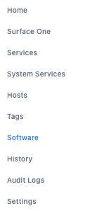
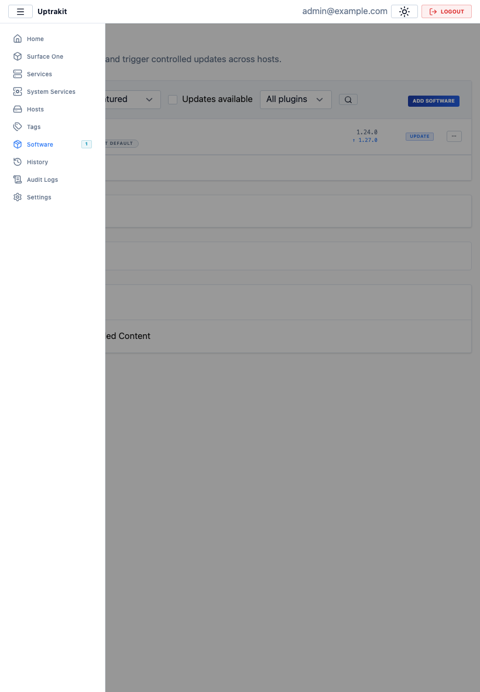
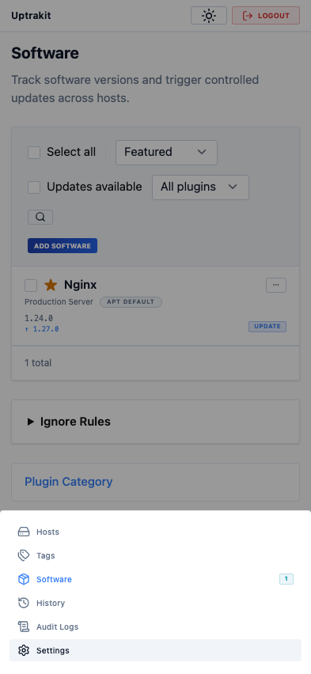
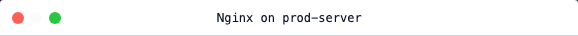
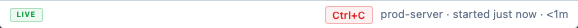
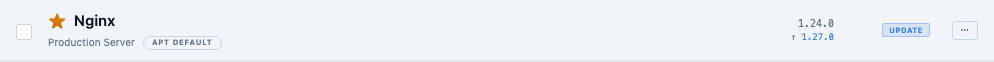
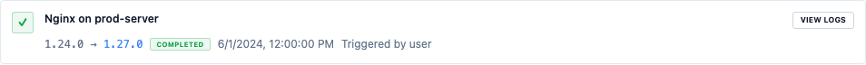

<!-- markdownlint-disable MD013 -->

# Layout

---

## App Shell Measurements

**Status:** `Implemented` for shell measurements  
**Status:** `Target` for responsive shell behavior

| Region          | Value       |
| --------------- | ----------- |
| Sidebar width   | `180px`     |
| Top bar height  | `40px`      |
| Content padding | `12px 14px` |

---

## Sidebar

| Property            | Value                  |
| ------------------- | ---------------------- |
| Background          | `--bg-surface`         |
| Right border        | `--border-subtle`      |
| Nav section headers | `7.5px` bold uppercase |
| Nav item height     | `28px`                 |
| Nav item radius     | `3px`                  |
| Nav item font       | `10px`                 |

Active nav item state: accent tint background, accent text, colored nav icon.
Nav items include a lucide icon to the left of the label (sidebar) or above the label (mobile bottom
nav). See the Icons section in `primitives.md` for sizing and component type conventions.



---

## Top Bar

| Property      | Value                           |
| ------------- | ------------------------------- |
| Height        | `40px`                          |
| Title         | `12px` bold                     |
| Optional chip | item count                      |
| Right side    | search input and primary action |

---

## Public Entry Shell

Routes `/login`, `/register`, `/device`, and `frontend/src/routes/+error.svelte` share
`PublicEntryShell.svelte`.

Props:

```typescript
{
  eyebrow?: string;   // default: 'Uptrakit' — small uppercase label above title
  title: string;      // h1 at 24px/600 (larger than page-content h1)
  subtitle?: string;  // secondary line below title
  children: Snippet;  // form / body content
  footer?: Snippet;   // rendered in a bordered footer strip at the bottom
}
```

For form layout inside the shell, use the exported constant:

```typescript
import { PUBLIC_ENTRY_FORM_CLASS } from "$lib/components/ui/PublicEntryShell.svelte";
// PUBLIC_ENTRY_FORM_CLASS = 'space-y-4'
```

Rules:

- Public-entry routes do not render authenticated shell chrome (sidebar, mobile bottom nav,
  current-user controls).
- The auth guard redirects protected routes to `/login`; 4xx/5xx routes stay on the public-entry
  error shell instead of redirecting.
- Route-specific semantics remain allowed: device-code block, account-linking flow, first-user
  setup, and public error recovery actions.
- Content scrolls independently.

---

## Responsive Layout

**Status:** `Implemented`

| Breakpoint | Range        | Layout                 |
| ---------- | ------------ | ---------------------- |
| Desktop    | `>= 1024px`  | Full sidebar           |
| Tablet     | `640–1023px` | Overlay sidebar drawer |
| Mobile     | `< 640px`    | Bottom navigation bar  |

Implemented:

- Tablet sidebar overlay drawer. ✓
- Mobile bottom nav: 4 highest-priority top-level nav items. ✓
- Overflow into shared bottom sheet. ✓
- Built-in and `surface.page` entries use unified sort order across all breakpoints. ✓
- Mobile toasts: bottom-center positioning, swipe-down dismiss. ✓

Implemented:

- Mobile software rows expand inline. `SoftwareGroupList` renders a card-per-item layout at `< 640px`. Compact single-host items show name + hostname + plugin badge + version + action. Multi-host items show name + expand pill + host count; expanding reveals host sub-cards indented with a left border.
- `DataTable` `mobileMode='cards'` provides column-defined card layout (auto `<dl>/<dt>/<dd>`) or a custom `mobileRow` snippet. `mobileMode='scroll'` enables horizontal scroll with `w-max` on the table.
- Mobile snapshot coverage via `chromium-mobile` and `chromium-mobile-dark` Playwright projects at 393×852.

Responsive layout captures:





**Adding a new built-in nav item:** edit the `builtInNavItems` array in
`frontend/src/routes/+layout.svelte`. Each entry needs `href`, `label`, `priority`, and an
optional `permission` guard. Choose a `priority` that places the item in the correct mobile
position — items beyond index 3 go into the bottom-sheet overflow.

**Nav item badges:** `ShellNavItem` has an optional `badge?: string` field. Badges are
injected in the `navItems` `$derived` expression (not in `builtInNavItems`) via a `formatBadge`
helper. The Software item currently shows a count badge from the
`frontend/src/lib/stores/software-updates.svelte.ts` store:

```typescript
badge: item.href === "/software"
  ? formatBadge(getUpdatableSoftwareCount())
  : undefined;
```

`formatBadge` returns `undefined` for null/0, `String(count)` for 1–99, and `"99+"` for ≥100.
Badges render as `<StatusBadge tone="info" label={item.badge} />` in all four nav templates.
Desktop, tablet, and overflow templates use `ml-auto pl-1.5`; mobile primary uses
`shrink-0 pl-1.5` (no `ml-auto`) to avoid conflicting with `justify-center`.

The software-updates store fetches the count once on auth (idempotent — safe to call from a
re-running `$effect`) and is wired in `+layout.svelte` behind `Permission.ViewSoftware`. Future
SSE live-update of the count can be added inside the store by subscribing to
`software_item_updated` and `version_check_completed` events without any layout changes.

Built-in nav priorities (lower number = higher priority = shown first on mobile):

| Item            | Priority |
| --------------- | -------- |
| Home            | `100`    |
| Services        | `200`    |
| System Services | `300`    |
| Hosts           | `400`    |
| Tags            | `450`    |
| Software        | `500`    |
| History         | `800`    |
| Audit Logs      | `900`    |
| Settings        | `1000`   |

Visual regression fixtures:
`frontend/tests/e2e/ui-parity-responsive.test.ts` captures tablet sidebar overlay and mobile
bottom-nav overflow states on Chromium.

---

## Workflow / Wizard Shell

**Status:** `Implemented`

Multi-step workflows use the standard `ModalShell` with a step indicator row rendered above the
step body. The `SurfaceWorkflow` component implements this pattern for surface-backed workflows.

Step indicator chip states:

| State     | Visual                                            |
| --------- | ------------------------------------------------- |
| Completed | `--color-success` tint                            |
| Active    | `--accent` tint, `--accent-bright` text           |
| Upcoming  | `--bg-raised` background, `--text-secondary` text |

Rules:

- Step chips are `18px` tall.
- The active step label is always visible in the step indicator row.
- Each workflow step must provide a non-empty `label` — the runtime will not synthesize one.
- Steps use `SchemaForm` for form-driven input; non-form steps use arbitrary Snippet content.

---

## Terminal Output Shell

**Status:** `Implemented`

One shared terminal-shell component serves History and Software Detail. Terminal behavior:

| Property          | Value                               |
| ----------------- | ----------------------------------- |
| Backdrop          | `rgba(0,0,0,.78)`                   |
| Default size      | `580px × 380px`                     |
| Titlebar height   | `36px`                              |
| Status bar height | `28px`                              |
| Default radius    | `6px`                               |
| Maximized size    | `92vw × 88vh`                       |
| Maximized radius  | `4px`                               |
| Mobile            | Full-screen, no maximize affordance |

Traffic lights:

- Red closes the terminal.
- Yellow is visible but disabled.
- Green toggles maximize.
- Hovering any dot reveals all three icons.

Close paths: red button, `Escape`, backdrop click.





Title format: `<software-name> on <hostname>`

Status bar format: badge on the left · `<hostname> · started <relative-time> · <duration>` on the right.

Rules:

- `close` resets shell maximize state.
- Live/captured mode can change after mount; stdin wiring follows `onInput` dynamically.
- Parity snapshots for the final shell stay at `<= 0.5%`.
- Desktop parity captures titlebar and status-bar chrome regions.
- Mobile parity captures full-screen shell plus titlebar and status-bar regions.

---

## Page-Level Patterns

### Software Page

**Status:** `Implemented`



- Software items are top-level groups; hosts are sub-rows.
- Built-in and surface-backed `software.tabs` share one tab strip and one body container.
- Active tab persists in `?tab=<tab-id>`.
- Column grid: `16px 1fr 120px 88px`.
- Header-row version column is always empty; version column on host rows is a two-line
  installed/latest stack.
- Host-row background is transparent until hover.
- Truncation row uses `▸ N more`.

### Hosts Page

**Status:** `Implemented`

- Standard table layout.
- Software-status badge uses the navigable badge pattern (see `ActionBadge` in `primitives.md`).
- `N updates` navigates to Software; `X error` navigates to History.
- `Up to date` and `Unknown` are static `StatusBadge` instances.

### History Page

**Status:** `Implemented`



- Chronological feed grouped by date.
- Icon square + body + right meta per row.
- Row-level "view log" actions open the shared terminal modal.
- Waiting/no-output, truncation, recovery, and actor details render as terminal callouts inside the
  modal.
- Interactive sessions expose live controls (e.g. `Ctrl+C`) inside terminal status actions.

### Settings Page

**Status:** `Implemented`


- Built-in settings sections and `settings.tabs` share one tab strip.
- Active tab persists in `?tab=<tab-id>`.
- Form-heavy views historically referenced a `110px` label width; current `FormFieldRow` uses a
  responsive `minmax(0,16rem)` grid column. No manual width override is needed when using
  `FormFieldRow`.
- Destructive actions live in a danger zone at the bottom of the page.
- `settings.below.global` renders below built-in global settings content.

### Slot-Backed Detail Panels

**Status:** `Implemented`

- `host_detail.tabs` is an inline card stack (not a tab strip).
- `settings.below.global` is an inline panel stack.
- Targeted surfaces keep their provider selector inside host-owned panel chrome, above rendered nodes.
- No-provider state uses the shared `EmptyState` component.
- Parity capture regions use stable host markers such as `data-parity-region`.
