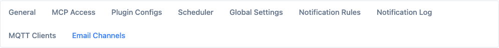
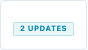
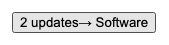
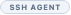
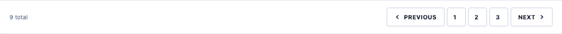
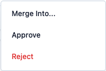

<!-- markdownlint-disable MD013 -->

# Shared Primitives

All primitives are exported from `frontend/src/lib/components/ui/index.ts`.

Import pattern:

```typescript
import { Button, Callout, StatusBadge } from '$lib/components/ui';
```

Non-UI-barrel components (`Button`, `Input`, `Textarea`, `Checkbox`, `Modal`, `ContextMenu`) are in
`$lib/components` and re-exported through the barrel where noted.

**Status:** `Implemented` (all components below)

---

## Layout Primitives

### PageShell

Full-page container with eyebrow, title, description, and an actions slot.

```typescript
// frontend/src/lib/components/ui/PageShell.svelte
{
  eyebrow?: string;       // small uppercase label above the title
  title: string;          // h1 at 20px bold
  description?: string;   // secondary paragraph below title
  actions?: Snippet;      // right-aligned action area (buttons, etc.)
  children: Snippet;      // page body content
}
```

Usage:

```svelte
<PageShell title="Hosts" description="Registered agents in this tenant.">
  {#snippet actions()}
    <Button variant="primary">Add host</Button>
  {/snippet}
  <!-- body -->
</PageShell>
```

- Renders a `<section data-ui="page-shell">` with a responsive header that stacks on narrow screens.
- `actions` is always `shrink-0` and wraps naturally if multiple controls are present.

---

### SectionCard

Bordered surface card for grouped settings, detail panels, or any contained section body.

```typescript
// frontend/src/lib/components/ui/SectionCard.svelte
{
  title?: string;          // h2 section heading
  description?: string;    // secondary paragraph below heading
  actions?: Snippet;       // right-aligned header actions
  children: Snippet;       // card body
}
```

Usage:

```svelte
<SectionCard title="Authentication" description="Configure login options.">
  {#snippet actions()}
    <Button variant="ghost" size="sm">Edit</Button>
  {/snippet}
  <!-- form rows -->
</SectionCard>
```

- Renders `rounded-[3px] border border-[var(--border-subtle)] bg-[var(--bg-surface)] shadow-sm`.
- Header section has a bottom border separating it from the body.
- Omit `title`, `description`, and `actions` to render the card without a header.

---

## Navigation Primitives

### TabStrip

Accessible tab list with keyboard navigation, ARIA roles, and panel association.

```typescript
// frontend/src/lib/components/ui/TabStrip.svelte
export type TabStripItem = {
  id: string;
  label: string;
  panelId?: string;   // aria-controls value; derived from idBase if omitted
  tabId?: string;     // id on the button; derived from idBase if omitted
  disabled?: boolean;
};

{
  items: TabStripItem[];
  activeId?: string;          // currently selected tab id
  ariaLabel?: string;         // defaults to "Tabs"
  idBase?: string;            // prefix for auto-generated tab/panel ids
  onSelect?: (id: string) => void;
}
```

Usage:

```svelte
<script lang="ts">
  let activeTab = $state('general');
</script>

<TabStrip
  items={[
    { id: 'general', label: 'General' },
    { id: 'security', label: 'Security' },
  ]}
  activeId={activeTab}
  idBase="settings"
  onSelect={(id) => { activeTab = id; }}
/>
```



Keyboard behavior: `ArrowRight`/`ArrowDown` → next enabled tab, `ArrowLeft`/`ArrowUp` → previous,
`Home` → first, `End` → last. Focus moves with selection.

Visual rules:

- Active tab: `bg-[rgba(var(--accent-rgb),0.12)] text-[var(--accent-bright)]`
- Inactive tab hover: `hover:bg-[var(--bg-raised)] hover:text-[var(--text-primary)]`
- Disabled: `opacity-40 pointer-events-none`

`host_detail.tabs` is currently an inline card stack, not a `TabStrip`.

---

## Feedback Primitives

### Callout

Semantic message block for inline notices. Maps to ARIA `role="alert"` for warning/danger and
`role="status"` for info/success.

```typescript
// frontend/src/lib/components/ui/Callout.svelte
export type CalloutTone = 'info' | 'success' | 'warning' | 'danger';

{
  tone?: CalloutTone;   // default: 'info'
  title?: string;       // bold leading line
  message?: string;     // body text at 90% opacity
  children?: Snippet;   // arbitrary body content (use instead of or alongside message)
}
```

Usage:

```svelte
<Callout tone="danger" message="Failed to load hosts." />

<Callout tone="warning" title="Requires restart">
  Changes take effect after the agent restarts.
</Callout>
```

Tone → token mapping:

| Tone | Text | Background | Border |
| --- | --- | --- | --- |
| `info` | `--color-info` | `--color-info-bg` | `--color-info-border` |
| `success` | `--color-success` | `--color-success-bg` | `--color-success-border` |
| `warning` | `--color-warning` | `--color-warning-bg` | `--color-warning-border` |
| `danger` | `--color-danger` | `--color-danger-bg` | `--color-danger-border` |

Do not use `<aside class="preset-filled-error-500">` or similar Skeleton utilities. Always use
`<Callout>`.

---

### EmptyState

Placeholder for list and table views with no rows, or filtered views with no matches.

```typescript
// frontend/src/lib/components/ui/EmptyState.svelte
{
  title: string;          // bold heading
  description?: string;   // secondary explanation
  actions?: Snippet;      // optional centered action area (e.g. a ghost Button)
}
```

Usage:

```svelte
<EmptyState
  title="No hosts registered"
  description="Enroll your first agent to get started."
>
  {#snippet actions()}
    <Button variant="ghost" href="/enroll">Enroll a host</Button>
  {/snippet}
</EmptyState>
```

Renders with a dashed border and centered content. Max width of the inner block is `28rem`.

---

## Badge Primitives

### StatusBadge

Static label badge. Used for status indicators, tags, and any inline label that does not trigger
an action.

```typescript
// frontend/src/lib/components/ui/StatusBadge.svelte
export type StatusBadgeTone = 'neutral' | 'info' | 'success' | 'warning' | 'danger';

{
  tone?: StatusBadgeTone;   // default: 'neutral'
  label: string;
}
```

Usage:

```svelte
<StatusBadge tone="success" label="Approved" />
<StatusBadge tone="warning" label="Requires restart" />
<StatusBadge tone="danger" label="Error" />
<StatusBadge tone="neutral" label="Pending" />
```

Tone → token mapping:

| Tone | Text | Background | Border |
| --- | --- | --- | --- |
| `neutral` | `--text-secondary` | `--bg-raised` | `--border-default` |
| `info` | `--color-info` | `--color-info-bg` | `--color-info-border` |
| `success` | `--color-success` | `--color-success-bg` | `--color-success-border` |
| `warning` | `--color-warning` | `--color-warning-bg` | `--color-warning-border` |
| `danger` | `--color-danger` | `--color-danger-bg` | `--color-danger-border` |

Dimensions: `min-h-[14px]`, `2px` radius, `7.5px` bold uppercase text with 1px border.

Do not use `<span class="badge preset-tonal-*">`. Always use `<StatusBadge>`.

---

### ActionBadge

Clickable badge with idle/hover label swap inside a fixed-width container. Used for navigable
counts (e.g. "3 updates") and batch-update triggers.

```typescript
// frontend/src/lib/components/ui/ActionBadge.svelte
export type ActionBadgeVariant = 'navigation' | 'bulk-update';
export type ActionBadgeTone = 'info' | 'accent' | 'danger';

{
  variant?: ActionBadgeVariant;   // default: 'navigation'
  tone: ActionBadgeTone;
  idleLabel: string;              // text shown at rest
  hoverLabel: string;             // text shown on hover (same width container)
  disabled?: boolean;
  onclick?: (event: MouseEvent) => void;
}
```

Usage:

```svelte
<ActionBadge
  tone="info"
  idleLabel="3 updates"
  hoverLabel="Update all"
  onclick={handleUpdateAll}
/>
```

 

Rules:

- The hover label overlays the idle label using CSS grid; no layout reflow occurs.
- `navigation` variant: `min-h-[14px]`. `bulk-update` variant: `min-h-[16px]`.
- `violet` and `dim` static-only badges are `StatusBadge` with `neutral` tone; `ActionBadge` does
  not support them.
- Disabled state: `opacity-40 pointer-events-none`.

---

### PillBadge

Pill-shaped categorical label. Used for agent type, OS, plugin type, and similar taxonomy labels
where the value is not a status.

```typescript
// frontend/src/lib/components/ui/PillBadge.svelte
{
  label: string;
}
```

Usage:

```svelte
<PillBadge label="Linux" />
<PillBadge label="NPM" />
```



Renders `rounded-full border border-[var(--border-default)] bg-[var(--bg-raised)]`, no tone
variants. Use `StatusBadge` for status-carrying values.

---

## Form Primitives

### FormFieldRow

Labeled form field wrapper with hint and error display. Provides ARIA `aria-describedby` context
to child `Input` and `Textarea` components automatically.

```typescript
// frontend/src/lib/components/ui/FormFieldRow.svelte
{
  label: string;
  hint?: string;          // secondary helper text below the label
  error?: string;         // error message; triggers red text below the field
  inputId?: string;       // connects label[for] and generates error id
  required?: boolean;     // shows red asterisk next to label
  children: Snippet;      // the input control(s)
}
```

Usage:

```svelte
<FormFieldRow label="Email address" inputId="user-email" required>
  <Input id="user-email" type="email" bind:value={email} />
</FormFieldRow>

<FormFieldRow
  label="Webhook URL"
  inputId="webhook-url"
  hint="Must be HTTPS."
  error={urlError}
>
  <Input id="webhook-url" type="url" bind:value={webhookUrl} error={urlError} />
</FormFieldRow>
```

Layout: `grid gap-3 md:grid-cols-[minmax(0,16rem)_minmax(0,1fr)]` — label column is up to `16rem`
wide, input column fills the rest. Stacks to a single column on narrow screens.

---

### Input

Single-line text input. Supports error state, disabled state, and bindable value.

```typescript
// frontend/src/lib/components/Input.svelte
export type InputType = 'text' | 'email' | 'password' | 'url' | 'number' | 'search';

{
  id: string;
  type: InputType;
  value: string | number;         // bindable
  name?: string;
  placeholder?: string;
  autocomplete?: string;
  disabled?: boolean;
  required?: boolean;
  error?: string;                 // sets aria-invalid and error styling
  min?: number | string;
  max?: number | string;
  oninput?: (e: Event) => void;
  onblur?: (e: FocusEvent) => void;
  onkeydown?: (e: KeyboardEvent) => void;
  'aria-describedby'?: string;
  'aria-label'?: string;
  class?: string;
}
```

When placed inside `<FormFieldRow inputId="...">`, `aria-describedby` is wired automatically via
Svelte context — no manual prop needed.

Error state: `border-[var(--color-danger-border)] bg-[var(--color-danger-bg)]` via `aria-invalid`.
Height: `h-8` (`32px`). Radius: `3px`.

---

### Textarea

Multi-line text input. Identical token contract to `Input`.

```typescript
// frontend/src/lib/components/Textarea.svelte
export type TextareaVariant = 'default' | 'mono';

{
  id: string;
  value: string;            // bindable
  name?: string;
  placeholder?: string;
  rows?: number;
  disabled?: boolean;
  required?: boolean;
  error?: string;
  variant?: TextareaVariant;   // 'mono' applies font-mono text-[13px]
  oninput?: (e: Event) => void;
  onblur?: (e: FocusEvent) => void;
  'aria-describedby'?: string;
  class?: string;
}
```

Minimum height `4rem` (`min-h-[4rem]`), resizable vertically.

---

### Checkbox

Single checkbox input with bindable `checked` and `indeterminate` states.

```typescript
// frontend/src/lib/components/Checkbox.svelte
{
  id: string;
  checked?: boolean;          // bindable, default false
  indeterminate?: boolean;    // bindable, default false
  name?: string;
  disabled?: boolean;
  onchange?: (e: Event) => void;
  class?: string;
  'aria-label'?: string;
}
```

Color note: `@tailwindcss/forms` sets `appearance: none` on checkboxes making `accent-color` inert.
The checked fill uses `currentColor` from the `text-[var(--accent)]` class. Do not use
`accent-[var(--accent)]`.

---

## Data Display Primitives

### DataTable

Accessible table with loading, error, and empty states built in. Accepts column definitions for the
default header/row rendering, or fully custom `header`/`row` snippets.

```typescript
// frontend/src/lib/components/ui/DataTable.svelte
export type DataTableColumn = {
  key: string;
  label: string;
  align?: 'left' | 'center' | 'right';
};

{
  columns: DataTableColumn[];
  rows: Record<string, unknown>[];
  caption?: string;                // screen-reader caption
  loading?: boolean;               // shows "Loading..." text
  error?: string | null;           // shows Callout with danger tone
  emptyTitle?: string;             // default: 'No rows available'
  emptyDescription?: string;
  header?: Snippet;                // replaces default <thead> row
  row?: Snippet<[Record<string, unknown>]>;  // replaces default <tr>
  footer?: Snippet;                // rendered below the table (e.g. TableFooterBar)
  rowKey?: (row: Record<string, unknown>, index: number) => string | number;
  errorActions?: Snippet;          // action area inside the error Callout
  rowActions?: Snippet<[Record<string, unknown>]>;
  rowActionsLabel?: string;        // default: 'Actions'
}
```

Usage (simple):

```svelte
<DataTable
  columns={[
    { key: 'name', label: 'Name' },
    { key: 'status', label: 'Status', align: 'right' },
  ]}
  {rows}
  {loading}
  {error}
  emptyTitle="No hosts"
/>
```

Usage (custom row):

```svelte
<DataTable {columns} {rows} {loading} {error}>
  {#snippet row(r)}
    <tr class="border-b border-[var(--border-subtle)] hover:bg-[var(--bg-raised)]">
      <td class="table-cell-pad text-table-body text-[var(--text-primary)]">{r.name}</td>
      <td class="table-cell-pad text-right">
        <StatusBadge tone={r.status === 'ok' ? 'success' : 'danger'} label={r.status} />
      </td>
    </tr>
  {/snippet}
  {#snippet footer()}
    <TableFooterBar {total} {currentPage} {totalPages} {onPageChange} />
  {/snippet}
</DataTable>
```

Visual rules:

- Header: `bg-[var(--bg-raised)]`, `text-[var(--text-secondary)]`, `text-table-header font-semibold uppercase tracking-table-header`.
- Body rows: `text-table-body`, bottom border except last row. Cell padding: `table-cell-pad`. Two row highlight modes are supported:
  - **Hover-only:** `hover:bg-[var(--bg-raised)]` — rows transparent at rest, highlighted on hover.
  - **Zebra + hover:** `even:bg-[var(--bg-raised)]` fill with `hover:bg-[var(--bg-hover)]` — alternating fill plus a distinct hover highlight on all rows. Odd rows go `--bg-surface` → `--bg-hover` on hover; even rows go `--bg-raised` → `--bg-hover`. Hover is visible on all rows. Preferred for high-density read-only log tables (e.g. audit logs).
- Container: `rounded-panel border border-[var(--border-subtle)]`.

---

### TableFooterBar

Pagination footer for `DataTable`.

```typescript
// frontend/src/lib/components/ui/TableFooterBar.svelte
{
  total: number;
  currentPage: number;
  totalPages: number;
  onPageChange: (page: number) => void;
}
```



Renders a `border-t border-[var(--border-subtle)]` bar with "N total" on the left and a
`Pagination` control on the right. Always used inside the `footer` snippet of `DataTable`.

---

### ContextMenuItem

Single menu item inside a `ContextMenuShell`. Carries `role="menuitem"` and handles destructive
styling automatically.

```typescript
// frontend/src/lib/components/ui/ContextMenuItem.svelte
{
  label: string;
  destructive?: boolean;   // renders text in --color-danger
  disabled?: boolean;
  onclick?: (event: MouseEvent) => void;
}
```

`ContextMenuShell` (re-exported from `ContextMenu.svelte`) is positioned absolutely via `top`/`left`
coordinates supplied by the caller. It manages keyboard navigation, viewport overflow adjustment,
and click-outside dismiss.

```typescript
// frontend/src/lib/components/ContextMenu.svelte
{
  top: number;       // px offset from viewport top
  left: number;      // px offset from viewport left
  onclose?: () => void;
  children: Snippet;
}
```

Usage:

```svelte
<script lang="ts">
  let menuTop = $state(0);
  let menuLeft = $state(0);
  let showMenu = $state(false);

  function openMenu(e: MouseEvent) {
    menuTop = e.clientY;
    menuLeft = e.clientX;
    showMenu = true;
  }
</script>

{#if showMenu}
  <ContextMenuShell top={menuTop} left={menuLeft} onclose={() => { showMenu = false; }}>
    <ContextMenuItem label="View details" onclick={handleView} />
    <ContextMenuItem label="Delete" destructive onclick={handleDelete} />
  </ContextMenuShell>
{/if}
```



Row height: `min-h-8` (`32px`). Horizontal padding: `px-3`. Font: `12px medium`. Hover fill:
`bg-[var(--bg-raised)]`.

Context menu shell dimensions:

- Background: `--bg-surface`
- Border: `--border-default`
- Radius: `4px`
- Destructive items use `--color-danger` text token.

`software_item.host_context_menu` contributes launcher entries using this component — it does not
render nested grouped sub-menus.

---

## Action Primitives

### Button

Renders either an `<a role="button">` (when `href` is set) or a `<button>` element. Both share
identical visual treatment and state management.

```typescript
// frontend/src/lib/components/Button.svelte
export type ButtonVariant = 'primary' | 'ghost' | 'danger' | 'secondary';
export type ButtonSize = 'sm' | 'md';

// Link form (href required):
{
  variant: ButtonVariant;
  href: string;
  target?: string;
  rel?: string;
  size?: ButtonSize;         // default: 'md'
  disabled?: boolean;
  loading?: boolean;
  leadingIcon?: Snippet;
  trailingIcon?: Snippet;
  ariaLabel?: string;
  class?: string;
  children?: Snippet;
}

// Button form (no href):
{
  variant: ButtonVariant;
  size?: ButtonSize;
  type?: 'button' | 'submit' | 'reset';   // default: 'button'
  disabled?: boolean;
  loading?: boolean;
  leadingIcon?: Snippet;
  trailingIcon?: Snippet;
  ariaLabel?: string;
  onclick?: MouseEventHandler<HTMLButtonElement>;
  class?: string;
  children?: Snippet;
}
```

Usage:

```svelte
<Button variant="primary" onclick={handleSave}>Save changes</Button>
<Button variant="ghost" size="sm" href="/settings">Back</Button>
<Button variant="danger" onclick={handleDelete}>Delete</Button>
<Button variant="primary" loading={saving}>Saving…</Button>
```

Variants:

| Variant | Background | Border | Text |
| --- | --- | --- | --- |
| `primary` | accent gradient (`--accent-deep` → `--accent`) | none | `--text-inverted` |
| `ghost` | transparent | `--border-default` | `--text-primary` |
| `danger` | `--color-danger-bg` | `--color-danger-border` | `--color-danger` |
| `secondary` | `--bg-raised` | `--border-default` | `--text-primary` |

Sizes:

| Size | Height | Padding | Font |
| --- | --- | --- | --- |
| `md` | `23px` | `px-3` | `9px` |
| `sm` | `19px` | `px-2` | `8.5px` |

Loading state: replaces leading icon with a `9px` spinning border ring; sets `aria-busy`. Disabled
state: `opacity-40 pointer-events-none` (also `aria-disabled` on link form).

Do not use `<a class="btn btn-sm preset-tonal">` Skeleton patterns. Always use `<Button>`.

---

## Dialog Primitives

### ConfirmDialog

Opinionated confirmation modal for destructive or irreversible actions. Always prefer this over
building a custom confirmation flow inline.

```typescript
// frontend/src/lib/components/ConfirmDialog.svelte
{
  title: string;
  messagePrefix: string;        // "Are you sure you want to delete"
  entityName: string;           // the thing being acted on, rendered in bold
  confirmLabel: string;         // button label, e.g. "Delete"
  confirmVariant?: 'primary' | 'danger';  // default: 'danger'
  warnings?: string[];          // optional list of consequence bullets
  onconfirm: () => void;
  oncancel: () => void;
}
```

Usage:

```svelte
<ConfirmDialog
  title="Delete host"
  messagePrefix="Are you sure you want to delete"
  entityName={host.name}
  confirmLabel="Delete"
  warnings={['All associated data will be removed.']}
  onconfirm={handleDelete}
  oncancel={() => { showConfirm = false; }}
/>
```

Not in the UI barrel — import directly:

```typescript
import ConfirmDialog from '$lib/components/ConfirmDialog.svelte';
```

---

### ModalShell

Re-exported as `ModalShell` from the barrel. Renders a centered dialog over a backdrop with an
optional title and footer slot.

```typescript
// frontend/src/lib/components/Modal.svelte
{
  onclose: () => void;
  title?: string;
  maxWidth?: string;    // Tailwind class, default: 'max-w-[380px]'
  children: Snippet;
  footer?: Snippet;
}
```

Usage:

```svelte
<ModalShell {onclose} title="Confirm deletion">
  <p class="text-sm text-[var(--text-secondary)]">This cannot be undone.</p>
  {#snippet footer()}
    <Button variant="ghost" onclick={onclose}>Cancel</Button>
    <Button variant="danger" onclick={handleConfirm}>Delete</Button>
  {/snippet}
</ModalShell>
```

Rules:

- Backdrop: `rgba(0,0,0,.55)`, z-index `900`.
- Modal window: z-index `910`, `4px` radius, `--bg-surface` background, `--border-subtle` border.
- `max-h-[calc(100vh-4rem)]` with `overflow-y-auto` on the body region.
- Close on `Escape` or backdrop click via `ModalBackdrop`.
- Footer is always right-aligned with `gap-2`.
- `aria-modal="true"`, `role="dialog"`, `aria-labelledby` wired when `title` is provided.

---

## ProviderSelector

Dropdown for selecting a surface provider in targeted slots. Host-owned chrome — surfaces must not
render this themselves; the slot host renders it above the surface content.

```typescript
// frontend/src/lib/components/ui/ProviderSelector.svelte
export type ProviderOption = {
  id: string;
  label: string;
  description?: string;
  disabled?: boolean;
};

{
  label?: string;              // dropdown label, default: 'Provider'
  providers: ProviderOption[];
  selectedId?: string;         // controlled; omit for uncontrolled
  onSelect?: (id: string) => void;
  emptyMessage?: string;       // default: 'No options available.'
}
```

Used by `SurfaceReadPanel` for targeted `surface.page` and other targeted slots. Do not use in
surface-rendered content — only in the host container layer.

---

## Stat Card

Navigable summary card. Shows a metric with a label and sub-label, linking to a detail page.
Used in the dashboard summary grid.

```typescript
// frontend/src/lib/components/ui/StatCard.svelte
export type StatCardTone = 'muted' | 'success' | 'info' | 'warning' | 'danger';

let {
  href,
  label,
  value,
  valueTone = 'muted',
  subLabel,
}: {
  href: string;
  label: string;
  value: string | number;
  valueTone?: StatCardTone;
  subLabel: string;
} = $props();
```

Tone → value color mapping:

| Tone | CSS token |
| --- | --- |
| `muted` | `--text-muted` |
| `success` | `--color-success` |
| `info` | `--color-info` |
| `warning` | `--color-warning` |
| `danger` | `--color-danger` |

Usage:

```svelte
<StatCard
  href="/hosts"
  label="Hosts"
  value={totalHosts}
  valueTone="success"
  subLabel="registered hosts"
/>
```

Rules:

- Always an `<a>` with required `href` — non-link stat display is out of scope.
- `3px` radius, `--bg-surface` background, `--border-subtle` border.
- Hover promotes border to `--accent` (no background change).
- Label: `7.5px` bold uppercase, `--text-secondary`.
- Value: `14px` bold; color follows `valueTone` (default `muted` → `--text-muted`).
- Sub-label: `10px`, `--text-secondary`.
- Standard transition and focus ring applied per `tokens.md`.
- Wrap in a grid (`grid-cols-1 sm:grid-cols-2 lg:grid-cols-4`) inside a `SectionCard`.

---

## Notes

**Toggle / Switch** — replaced by `Checkbox` throughout. Boolean settings use `<Checkbox>`, not a
track+thumb switch. The border-radius entry for "Toggle track" in `tokens.md` is a spec remnant.
