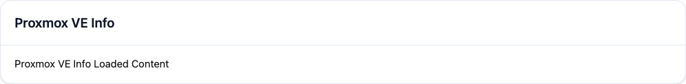
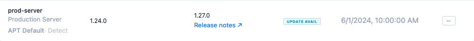
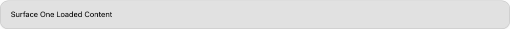

<!-- markdownlint-disable MD013 -->

# Surfaces

**Status:** `Implemented` for parity contract, slot registry, runtime states, and surface primitives  
**Status:** `Transitional` for shared-surface parity closure, slot governance, and parity CI rollout

---

## Core Rule

Surfaces are not a separate visual system. Built-in and surface-backed UI use the same tokens,
primitives, spacing, type scale, and states. Users must not be able to infer visual origin. Origin
leakage is a bug.

Hard rules:

- Built-in and surface-backed UI use the same tokens and primitives (see `tokens.md`, `primitives.md`).
- Origin-specific chrome is forbidden in surface-rendered content.
- New primitives needed for Surfaces must become shared design-system primitives.
- Raw contract IDs or renderer internals must never appear in user-facing UI.

---

## Slot Registry

| Slot ID | Host container | Visual rule |
| --- | --- | --- |
| `surface.page` | Top-level nav page | Same shell and nav treatment as built-in top-level pages |
| `settings.tabs` | Settings tab strip | Same `TabStrip` and body container as built-in settings tabs |
| `settings.below.global` | Global settings body | Same inline card stack as built-in global settings content |
| `software.tabs` | Software tab strip | Same `TabStrip` and body container as built-in software tabs |
| `host_detail.tabs` | Host detail body | Same inline card stack as built-in host detail content |
| `software_item.host_context_menu` | Software-item host context menu | Same launcher-row shell and standard modal shell as built-in actions |


Registration and aggregation rules:

- `surface.page` and `software_item.host_context_menu` are single-entry per provider registration.
- `settings.tabs`, `software.tabs`, `host_detail.tabs`, and `settings.below.global` are multi-entry.
- Aggregation order: `priority`, then `label`, then `surface_id`.
- Mixed built-in and `surface.page` nav order: `priority`, then `label`, then origin
  (`built-in` before `surface.page`), then stable ID.

Targeted-provider rules:

- Provider selector is host-owned chrome, not surface-owned content.
- Surfaces must not render a nested duplicate selector.
- Targeted `surface.page` selector lives below the heading, above content.
- No-provider body uses the shared `EmptyState` pattern.

---

## Surface Primitives

Surface-rendered content uses the same shared primitive set as built-in UI. No surface-only visual
widgets are allowed.

| Surface Primitive | Design treatment |
| --- | --- |
| `Section` | Vertical stack with `16px` gap |
| `TextBlock` | Standard body copy at `text-sm text-[var(--text-primary)]` |
| `KeyValue` | Same label/value rhythm as settings and detail views |
| `Table` | Canonical `DataTable` treatment |
| `Form` | Same `FormFieldRow` + `Input`/`Textarea`/`Checkbox` layout as built-in forms |
| `ActionBar` | Right-aligned action row with `flex gap-2 justify-end` |
| `Tabs` | Canonical `TabStrip` |
| `Callout` | Semantic info/warning/danger via shared `Callout` component |
| `EmptyState` | Canonical `EmptyState` component |
| `ModalTrigger` | Standard `ModalShell` |
| `WorkflowTrigger` | Standard workflow shell (see Workflow / Wizard Shell in `layout.md`) |

---

## Interaction Label Contract

**Status:** `Implemented`

- Shared-surface actions must provide a non-empty human-authored `interaction.label`.
- Workflow steps must provide a non-empty human-authored `workflow_step.label`.
- The shared runtime must not synthesize generic fallback copy: `Run action`, `Run workflow`,
  `Step`, `Open details`, or `Details` are forbidden fallbacks.
- Malformed or unlabeled interactions must degrade to the shared `Action unavailable` callout
  instead of rendering actionable UI.

---

## Runtime States

**Status:** `Implemented`

| State ID | Rendering rule |
| --- | --- |
| `loading` | Skeleton placeholders where shape is known |
| `permission_denied` | `EmptyState` or `Callout` explanation (no actionable controls) |
| `no_compatible_provider` | Shared `EmptyState` body — never a toast |
| `contract_mismatch` | `Callout` with `warning` tone |
| `hydration_action_failure` | Inline `Callout` with `danger` tone; keep layout intact |
| `no_surface_content` | Structural slots stay structural; non-structural slots omit themselves |

---

Slot parity examples:









## Parity Gates

The following pairs and matrices are mandatory for CI to pass:

- Built-in settings tab vs `settings.tabs`
- Built-in software tab vs `software.tabs`
- Built-in inline settings card vs `settings.below.global`
- Route-owned host-detail slot container vs `host_detail.tabs`
- Standard form field row vs targeted-surface provider selector
- Built-in context-menu item vs `software_item.host_context_menu` launcher
- Built-in action modal vs `software_item.host_context_menu` opened modal
- Built-in top-level nav item vs `surface.page` nav item
- Built-in page shell/body vs `surface.page` page shell/body

Required slot-state fixtures:

| Slot | Required states |
| --- | --- |
| `surface.page` | `loaded`, `permission_denied`, targeted `no_compatible_provider`, `contract_mismatch`, `hydration_action_failure` |
| `settings.tabs`, `software.tabs` | `loaded`, `permission_denied`, targeted `no_compatible_provider`, `contract_mismatch`, `no_surface_content` |
| `settings.below.global`, `host_detail.tabs` | `loaded`, `permission_denied`, targeted `no_compatible_provider`, `contract_mismatch`, `hydration_action_failure`, omitted |
| `software_item.host_context_menu` | launcher row, opened modal, fallback, omitted |

---

## Verification

Run the parity harness:

```bash
cd frontend && npm run test:e2e -- ui-parity
```

Visual regression is enforced by Playwright on macOS + Chromium only:

- Fixed locale: `en-US`
- Fixed timezone: `UTC`
- Reduced-motion capture
- DPR: `1`
- Viewport preset checks enforced
- Snapshot max diff: `0.5%`

CI fail conditions:

- Any visual diff above `0.5%` after approved masking.
- Any leaked contract ID or raw renderer fallback.
- Any missing required pair or state fixture without a waiver.

Markdown verification:

```bash
markdownlint --config .markdownlint.json \
  docs/development/ui/README.md \
  docs/development/ui/tokens.md \
  docs/development/ui/layout.md \
  docs/development/ui/primitives.md \
  docs/development/ui/surfaces.md \
  docs/development/README.md \
  docs/README.md
```

Design-language verification also requires:

- Deterministic parity fixtures for every new shared visual path.
- Dark and light theme coverage for all required pairs.
- Parity closure stays open while any required pair is missing paired dark/light captures.
- Removed built-in-only captures (e.g. prior audit/profile parity captures) do not count toward
  required built-in-vs-surface parity coverage.
- Adapter-manifest completeness via `frontend/src/lib/theme/adapter-manifest.test.ts`.


### Dynamic Masking Rules

- Only relative timestamps, versions, digests, animated spinners, and live log text may be masked.
- Use checked-in selectors or `data-visual-dynamic` attribute.
- Non-allowlisted selectors must fail the parity harness.
- Mask area budget is computed from the union area; overlapping masks are not double-counted.
- Masked area max `15%` unless narrowed by a waiver.

### Parity Config

Harness configuration: `frontend/tests/e2e/parity-config.ts`

---

## Waivers

**Status:** `Implemented`

Governance file: `frontend/tests/e2e/ui-parity-waivers.json`

Every waiver entry must include:

| Field | Description |
| --- | --- |
| `scope` | Affected pair or slot identifier |
| `owner` | Responsible team or engineer |
| `expiry_date` | ISO date after which the waiver is invalid |
| `capture_region` | CSS selector or `data-parity-region` value |
| `justification` | Short explanation of the known difference |
| `review_ref` | PR or issue reference |

Example:

```json
[
  {
    "scope": "host_context_modal/mobile",
    "owner": "frontend-owner",
    "expiry_date": "2026-06-30",
    "capture_region": "[data-parity-region='host-context-modal']",
    "justification": "Temporary mobile overflow mismatch during shell convergence.",
    "review_ref": "PR-1234"
  }
]
```

Waiver rules:

- Waivers are exception paths, not shortcuts.
- Scope each waiver to one specific issue.
- Time-limit every waiver.
- Link every waiver to review evidence.

---

## Current Rollout Status

The pair/state matrix above is the required target contract. Paired dark+light coverage is still
incomplete for some required pairs, so parity closure is not yet complete. Removed built-in-only
captures (such as prior audit/profile parity captures) are intentionally excluded and do not count
as required built-in-vs-surface parity coverage.
