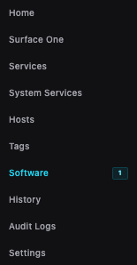
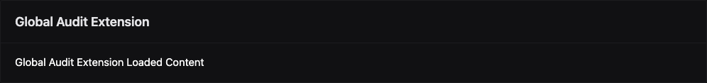
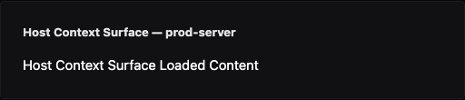
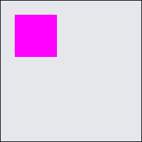

<!-- markdownlint-disable MD013 -->

# Surfaces

**Status:** `Implemented` for parity contract, slot registry, runtime states, and surface primitives  
**Status:** `Transitional` for shared-surface parity closure, slot governance, and parity CI rollout

---

## Core Rule

Surfaces are not a separate visual system. Built-in and surface-backed UI use the same tokens,
primitives, spacing, type scale, and states. Users must not be able to infer visual origin. Origin
leakage is a bug.

Hard rules:

- Built-in and surface-backed UI use the same tokens and primitives (see `tokens.md`, `primitives.md`).
- Origin-specific chrome is forbidden in surface-rendered content.
- New primitives needed for Surfaces must become shared design-system primitives.
- Raw contract IDs or renderer internals must never appear in user-facing UI.

---

## Slot Registry

| Slot ID | Host container | Visual rule |
| --- | --- | --- |
| `surface.page` | Top-level nav page | Same shell and nav treatment as built-in top-level pages |
| `settings.tabs` | Settings tab strip | Same `TabStrip` and body container as built-in settings tabs |
| `settings.below.global` | Global settings body | Same inline card stack as built-in global settings content |
| `software.tabs` | Software tab strip | Same `TabStrip` and body container as built-in software tabs |
| `host_detail.tabs` | Host detail body | Same inline card stack as built-in host detail content |
| `software_item.host_context_menu` | Software-item host context menu | Same launcher-row shell and standard modal shell as built-in actions |




Registration and aggregation rules:

- `surface.page` and `software_item.host_context_menu` are single-entry per provider registration.
- `settings.tabs`, `software.tabs`, `host_detail.tabs`, and `settings.below.global` are multi-entry.
- Aggregation order: `priority`, then `label`, then `surface_id`.
- Mixed built-in and `surface.page` nav order: `priority`, then `label`, then origin
  (`built-in` before `surface.page`), then stable ID.

**Structural vs non-structural slots:** `settings.tabs` and `software.tabs` are structural — their
container always renders even when no surface provides content. All other slots are non-structural
and omit themselves when `no_surface_content` applies. Defined in `SurfaceSlot.svelte` via
`STRUCTURAL_SLOTS`.

**Targeted vs non-targeted slots:** a targeted slot routes content to a specific provider selected
by the user via `ProviderSelector`. `targeting: 'targeted'` is set in the slot descriptor.
Non-targeted slots aggregate all registered providers without a provider selector.

Targeted-provider rules:

- Provider selector is host-owned chrome, not surface-owned content.
- Surfaces must not render a nested duplicate selector.
- Targeted `surface.page` selector lives below the heading, above content.
- No-provider body uses the shared `EmptyState` pattern.

---

## Surface Primitives

Surface-rendered content uses the same shared primitive set as built-in UI. No surface-only visual
widgets are allowed.

| Surface Primitive | Design treatment |
| --- | --- |
| `Section` | Vertical stack with `16px` gap |
| `TextBlock` | Standard body copy at `text-sm text-[var(--text-primary)]` |
| `KeyValue` | Same label/value rhythm as settings and detail views |
| `Table` | Canonical `DataTable` treatment |
| `Form` | Same `FormFieldRow` + `Input`/`Textarea`/`Checkbox` layout as built-in forms |
| `ActionBar` | Right-aligned action row with `flex gap-2 justify-end` |
| `Tabs` | Canonical `TabStrip` |
| `Callout` | Semantic info/warning/danger via shared `Callout` component |
| `EmptyState` | Canonical `EmptyState` component |
| `ModalTrigger` | Standard `ModalShell` |
| `WorkflowTrigger` | Standard workflow shell (see Workflow / Wizard Shell in `layout.md`) |

---

## Context Selector

**Status:** `Implemented`

A context selector lets a universal-targeting surface expose a host-owned dropdown that scopes all subsequent
interaction calls to a user-selected value (for example, choosing a Proxmox node before running host-targeted
actions). It is declared in the surface descriptor and rendered entirely by the host layer — surfaces must not
render their own equivalent selector.

### Contract interface

```typescript
// frontend/src/lib/surfaces/contract.ts
export interface SurfaceContextSelector {
  param_key: string;           // key injected into baseParams when a value is selected
  label: string;               // ProviderSelector dropdown label
  all_option_label: string;    // label for the "no filter / all" option (empty-string value)
  rest_api_path: string;       // GET endpoint; response must be an array or { items: [...] }
  value_field: string;         // field on each item used as the option value
  label_field: string;         // field on each item used as the option display label
  required_for_interactions: string[];  // interaction IDs that are disabled until a non-empty value is selected
}
```

The `'context_selector'` entry in the `SurfaceCapability` union signals that a surface descriptor may carry a
`context_selector` field. Surface capability declarations that include a context selector must list
`'context_selector'` in `required_capabilities`.

### Rendering rules

- The context selector is rendered by `SurfaceReadPanel` inside the non-targeted branch, before the
  `SurfaceRenderer` call.
- It uses the shared `ProviderSelector` component — the same component used for targeted-slot provider selection.
  Do not substitute a raw `<select>` element.
- The selector is shown only after `selectorFetchDone` is true (REST fetch has settled). No partial or
  skeleton state is shown during the fetch.
- The first option is always the `all_option_label` with an empty-string value, allowing users to deselect
  and return to an unfiltered view.
- The selector is constrained to `max-w-[280px]` with `mb-4` bottom margin, matching the targeted-slot
  provider selector layout.

### effectiveBaseParams

When a context selector is present and `selectedContextValue` is non-empty, `SurfaceReadPanel` builds an
`effectiveBaseParams` object that merges the selected value into `baseParams` under `param_key`. This
`effectiveBaseParams` is passed as `baseParams` to the root `SurfaceRenderer`. When no value is selected
(empty string), `effectiveBaseParams` is identical to the original `baseParams`.

```typescript
// Derived in SurfaceReadPanel
const effectiveBaseParams = $derived(
  contextSelector && selectedContextValue
    ? { ...baseParams, [contextSelector.param_key]: selectedContextValue }
    : { ...baseParams }
);
```

Hydration re-triggers automatically when `effectiveBaseParams` changes because the hydration fingerprint
includes `base_params`. No manual reload is required.

### requiredContextParam / requiredForInteractionIds prop chain

`SurfaceReadPanel` derives two props from the context selector and passes them down to `SurfaceRenderer`:

| Prop | Source | Purpose |
| --- | --- | --- |
| `requiredContextParam` | `contextSelector.param_key` | The key that must be non-empty for gated interactions |
| `requiredForInteractionIds` | `contextSelector.required_for_interactions` | Which interaction IDs are gated |

`SurfaceRenderer` accepts both props and forwards them to `SurfaceActionBar` when rendering an `action_bar`
node. `SurfaceActionBar` forwards `requiredContextParam` selectively — only to buttons whose
`interaction_id` appears in `requiredForInteractionIds`. This keeps ungated buttons always enabled.

**Forwarding rule:** any `SurfaceRenderer` recursive call that may contain an `action_bar` descendant must
forward both `requiredContextParam` and `requiredForInteractionIds`. Currently the `section` and `tabs`
recursive calls omit these props (see adherence findings); fix by passing both props at those call sites.

### Disabled-button tooltip pattern

When `isContextGated` is true in `SurfaceInteractionButton`, the button is wrapped in a `<span>` with a
`title` attribute:

```svelte
<span title="Select a configuration first">
  <Button variant={...} {size} disabled>
    {actionLabel}
  </Button>
</span>
```

Rules for this pattern:

- The `<span>` wrapper is required because `disabled` buttons do not fire mouse events; `title` on the
  `<button>` itself is invisible on hover in most browsers.
- The `title` text must be a short, user-facing prompt — not an internal ID or technical description.
- Use this wrapper only when the control is disabled due to a prerequisite that the user can satisfy
  within the same view. For permanent permission-based disabling, use `opacity-40 pointer-events-none`
  without a wrapper.
- This is the canonical pattern for prerequisite-gated surface actions. Do not implement alternatives
  (tooltips, inline callouts, hidden buttons) for this case.

---

## Interaction Label Contract

**Status:** `Implemented`

- Shared-surface actions must provide a non-empty human-authored `interaction.label`.
- Workflow steps must provide a non-empty human-authored `workflow_step.label`.
- The shared runtime must not synthesize generic fallback copy: `Run action`, `Run workflow`,
  `Step`, `Open details`, or `Details` are forbidden fallbacks.
- Malformed or unlabeled interactions must degrade to the shared `Action unavailable` callout
  instead of rendering actionable UI.

---

## Runtime States

**Status:** `Implemented`

| State ID | Rendering rule |
| --- | --- |
| `loading` | Loading text or spinner where shape is not known; no skeleton component exists |
| `permission_denied` | `EmptyState` or `Callout` explanation (no actionable controls) |
| `no_compatible_provider` | Shared `EmptyState` body — never a toast |
| `contract_mismatch` | `Callout` with `warning` tone |
| `hydration_action_failure` | Inline `Callout` with `danger` tone; keep layout intact |
| `no_surface_content` | Structural slots stay structural; non-structural slots omit themselves |

---

Slot parity examples:








## Parity Gates

The following pairs and matrices are mandatory for CI to pass:

- Built-in settings tab vs `settings.tabs`
- Built-in software tab vs `software.tabs`
- Built-in inline settings card vs `settings.below.global`
- Route-owned host-detail slot container vs `host_detail.tabs`
- Standard form field row vs targeted-surface provider selector
- Built-in context-menu item vs `software_item.host_context_menu` launcher
- Built-in action modal vs `software_item.host_context_menu` opened modal
- Built-in top-level nav item vs `surface.page` nav item
- Built-in page shell/body vs `surface.page` page shell/body

Required slot-state fixtures:

| Slot | Required states |
| --- | --- |
| `surface.page` | `loaded`, `permission_denied`, targeted `no_compatible_provider`, `contract_mismatch`, `hydration_action_failure` |
| `settings.tabs`, `software.tabs` | `loaded`, `permission_denied`, targeted `no_compatible_provider`, `contract_mismatch`, `no_surface_content` |
| `settings.below.global`, `host_detail.tabs` | `loaded`, `permission_denied`, targeted `no_compatible_provider`, `contract_mismatch`, `hydration_action_failure`, omitted |
| `software_item.host_context_menu` | launcher row, opened modal, fallback, omitted |

---

## Verification

Run the parity harness:

```bash
cd frontend && npm run test:e2e -- ui-parity
```

Visual regression is enforced by Playwright on macOS + Chromium only:

- Fixed locale: `en-US`
- Fixed timezone: `UTC`
- Reduced-motion capture
- DPR: `1`
- Viewport preset checks enforced
- Snapshot max diff: `0.5%`

Dark theme captures are required for all pairs. New parity fixtures should be added in both light and dark.

CI fail conditions:

- Any visual diff above `0.5%` after approved masking.
- Any leaked contract ID or raw renderer fallback.
- Any missing required pair or state fixture without a waiver.

Markdown verification:

```bash
markdownlint --config .markdownlint.json \
  docs/development/ui/README.md \
  docs/development/ui/tokens.md \
  docs/development/ui/layout.md \
  docs/development/ui/primitives.md \
  docs/development/ui/surfaces.md \
  docs/development/README.md \
  docs/README.md
```

Design-language verification also requires:

- Deterministic parity fixtures for every new shared visual path.
- Dark and light theme coverage for all required pairs.
- Parity closure stays open while any required pair is missing paired dark/light captures.
- Removed built-in-only captures (e.g. prior audit/profile parity captures) do not count toward
  required built-in-vs-surface parity coverage.
- Token completeness via `frontend/src/lib/theme/css-contract.test.ts`.




### Dynamic Masking Rules

- Only relative timestamps, versions, digests, animated spinners, and live log text may be masked.
- Use checked-in selectors or `data-visual-dynamic` attribute.
- Non-allowlisted selectors must fail the parity harness.
- Mask area budget is computed from the union area; overlapping masks are not double-counted.
- Masked area max `15%` unless narrowed by a waiver.

### Parity Config

Harness configuration: `frontend/tests/e2e/parity-config.ts`

---

## Waivers

**Status:** `Implemented`

Governance file: `frontend/tests/e2e/ui-parity-waivers.json`

Every waiver entry must include:

| Field | Description |
| --- | --- |
| `scope` | Affected pair or slot identifier |
| `owner` | Responsible team or engineer |
| `expiry_date` | ISO date after which the waiver is invalid |
| `capture_region` | CSS selector or `data-parity-region` value |
| `justification` | Short explanation of the known difference |
| `review_ref` | GitHub PR number in `PR-NNNN` format, e.g. `PR-1234` |

Example:

```json
[
  {
    "scope": "host_context_modal/mobile",
    "owner": "frontend-owner",
    "expiry_date": "2026-06-30",
    "capture_region": "[data-parity-region='host-context-modal']",
    "justification": "Temporary mobile overflow mismatch during shell convergence.",
    "review_ref": "PR-1234"
  }
]
```

Waiver rules:

- Waivers are exception paths, not shortcuts.
- Scope each waiver to one specific issue.
- Time-limit every waiver.
- Link every waiver to review evidence.

---

## Current Rollout Status

The pair/state matrix above is the required target contract.

Known open gaps (as of 2026-04-24):

- **Waivers file is empty.** `frontend/tests/e2e/ui-parity-waivers.json` contains `[]` — no
  active waivers. Any known mismatches must be filed here before the parity harness is enforced
  in CI.
- **Context selector prop forwarding gap.** `SurfaceRenderer` recursive calls for `section` and
  `tabs` nodes do not forward `requiredContextParam` and `requiredForInteractionIds`. An `action_bar`
  nested inside a `section` or `tabs` will not receive the context guard. Fix by forwarding both
  props at those call sites in `SurfaceRenderer.svelte`.

Removed built-in-only captures (such as prior audit/profile parity captures) are intentionally
excluded and do not count as required built-in-vs-surface parity coverage.
