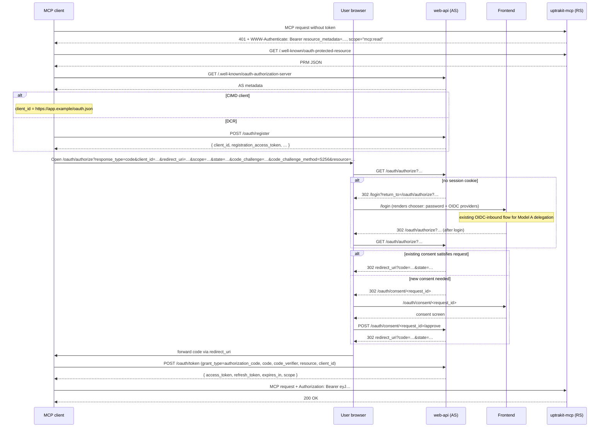

# MCP OAuth 2.1 Authorization — Design

Status: Draft for review
Author: Andrey Yantsen
Date: 2026-05-12
Target spec revision: MCP Authorization 2025-11-25

## 1. Goal

Add a spec-compliant OAuth 2.1 authorization flow to the MCP server (`uptrakit-mcp`) so that browser-capable MCP
clients (Claude Desktop, Cursor, future browser MCP integrations) can connect to a Controller without operators
having to manually mint and distribute opaque API tokens. The opaque API-token path (`upk_*`) remains supported
in parallel for non-interactive CLI and CI callers; this spec does not deprecate it.

## 2. Background

The MCP server was recently extracted from `uptrakit-web-api` into its own crate `uptrakit-mcp` (see
[`docs/superpowers/specs/2026-05-01-extract-mcp-crate-design.md`](2026-05-01-extract-mcp-crate-design.md)). The
crate already has its own auth layer (`McpAuthLayer`) and its own state object (`McpState`), but its only
authentication method is the existing opaque `upk_*` API token. JWTs are rejected explicitly. The MCP spec
revision the broader ecosystem is on — Claude Desktop, Cursor, MCP Inspector, the official TypeScript and Python
SDKs — is the 2025-11-25 Authorization specification, which requires OAuth 2.1, Protected Resource Metadata,
Resource Indicators, PKCE S256, and `WWW-Authenticate` discovery. Without those, MCP clients cannot connect.

The forward-compatibility comment on `McpRequestContext` (`#[non_exhaustive]`, "OAuth 2.1 will add fields") and
the deliberately temporary scaffolding around the extraction were a setup for this work. This spec executes it.

## 3. MCP Authorization Spec Compliance

Target: **MCP Authorization 2025-11-25**.

### 3.1 MUST (applied to uptrakit)

- OAuth 2.1 (`draft-ietf-oauth-v2-1-13`) for both confidential and public clients.
- Protected Resource Metadata (RFC 9728) served by `uptrakit-mcp` at both
  `/.well-known/oauth-protected-resource/mcp` (sub-path form, per RFC 9728 §3.1) and
  `/.well-known/oauth-protected-resource` (root form). Both serve the same document.
- 401 responses include `WWW-Authenticate: Bearer realm="mcp", resource_metadata="<PRM URL>", scope="mcp:read"`.
- 403 insufficient-scope responses include
  `WWW-Authenticate: Bearer error="insufficient_scope", scope="<needed>", resource_metadata="<PRM URL>"`.
- AS Metadata (RFC 8414) served by `uptrakit-web-api` at `/.well-known/oauth-authorization-server`.
- PKCE S256 mandatory. AS metadata advertises `code_challenge_methods_supported: ["S256"]`. The
  authorization endpoint rejects any `code_challenge_method` other than `S256` (no `plain`, no missing).
- Resource Indicators (RFC 8707): the `resource` parameter is required on both `/oauth/authorize` and
  `/oauth/token`. Access tokens carry `aud = "<canonical resource URL>"` (string, not array). Resource Server
  rejects tokens whose `aud` does not exactly match the canonical resource URL.
- Strict token-audience validation; no token passthrough; reject any foreign `aud` value.
- Redirect URIs validated by exact string match against pre-registered values. Allowed schemes: `https://`
  for any host, `http://` only for `localhost` / `127.0.0.1` / `[::1]`.
- For public clients (`token_endpoint_auth_method=none`): refresh-token rotation with replay-family
  detection.

### 3.2 SHOULD (implementing)

- Client ID Metadata Documents (CIMD, `draft-ietf-oauth-client-id-metadata-document-00`). AS metadata
  advertises `client_id_metadata_document_supported: true`. CIMD fetcher uses the existing
  `SsrfSafeResolver` (`uptrakit_shared_types::ssrf`, feature `http-ssrf`) per project HTTP-client policy.
- `WWW-Authenticate: scope="…"` is populated on every 401 and 403 challenge.
- Short-lived access tokens (15 min default), matching the existing Dashboard JWT lifetime.

### 3.3 MAY (implementing with policy)

- Dynamic Client Registration (RFC 7591) — **opt-in** (default OFF), rate-limited, and Operator-revocable.
  See §11.1 for the threat model behind opt-in by default. Per 2025-11-25 priority order, DCR is the
  fallback option after pre-registration and CIMD.
- RFC 7592 Client Configuration management endpoints (`GET`/`PUT`/`DELETE /oauth/register/{client_id}`)
  authenticated by the `registration_access_token` returned at DCR time.

### 3.4 Explicitly skipped v1

- OpenID Connect Discovery 1.0 — the Controller is an OAuth Authorization Server, not an OIDC Provider.
  Spec MUSTs let us provide either RFC 8414 _or_ OIDC Discovery; we pick RFC 8414.
- `private_key_jwt` client authentication — requires JWKS exposure that we do not yet need.
- RFC 8628 device authorization grant — deferred to a Phase 2 spec (see §22).
- `client_credentials` grant — deferred to a Phase 2 spec (see §22).
- Asymmetric JWT (RS256, ES256, EdDSA) — HMAC HS256 v1 (see §9).

## 4. Dependency Graph + Crate Layout

```text
controller-runtime
  ├── uptrakit-web-api          (HTTP routes, AppState, AS endpoints, consent backend)
  │     ├── uptrakit-web-api-auth   (JwtManager, RateLimitStore, SessionService — existing)
  │     ├── uptrakit-web-api-queries (TenantDb, ServiceNotifier, raw_settings)
  │     └── uptrakit-web-api-types  (typed request/response, oauth module — new)
  └── uptrakit-mcp              (MCP transport, RS auth layer, PRM endpoint)
        ├── uptrakit-controller-core (auth::api_token — existing)
        └── uptrakit-web-api-types   (oauth module — read-only consumer)
```

No new top-level crate. `uptrakit-mcp` does not gain a dependency on `uptrakit-web-api`; it consumes the new
OAuth wire types from `uptrakit-web-api-types` (which is already its dependency for `TriggerUpdateStatus` etc).

The signer secret, the JWT issuance code, the AS routes, the consent backend, and all DB tables live in
`uptrakit-web-api`. The Resource Server validator, the PRM endpoint, and the scope-aware tool gates live in
`uptrakit-mcp`. The two crates share only the typed wire enums (`McpScope`, `OAuthGrantType`, etc.) and the
`CanonicalResourceUrl` newtype, all defined in `uptrakit-web-api-types::oauth`.

### 4.1 rmcp SDK as client-side interop target

The `rmcp` crate (workspace pin: `1.5`, used today only for `transport-streamable-http-server`) ships
client-side OAuth support behind the `auth` + `transport-streamable-http-client-reqwest` feature flags. Its
client primitives (`OAuthState`, `AuthClient`, `AuthorizationManager`, `StreamableHttpClientTransport`) cover
the MCP-2025-11-25 client requirements: PKCE S256, `resource` parameter binding, PRM/AS-metadata discovery,
DCR + CIMD initiation, token refresh, and 403 step-up. **The SDK does not provide any server-side AS or RS
implementation** — its server-side OAuth example consumes tokens from an externally-provided AS.

What this means for our spec:

- The SDK is the **canonical client-interop target**. MCP clients built on `rmcp` (and clients built on the
  TypeScript / Python SDKs that mirror its semantics — Claude Desktop, Cursor, MCP Inspector) all behave the
  same way our spec assumes. Independent confirmation of compliance targets.
- The SDK does **not reduce or eliminate** any server-side work in this spec. Every AS endpoint, the RS
  validator, the PRM endpoint, refresh-token rotation, DCR/CIMD storage and validation, audit emission,
  rate-limiting, and the multi-controller boot guard are all written by us on axum/sea-orm/`jsonwebtoken`.
- We do not add the `auth` or client-reqwest features to our `rmcp` dependency v1 — they pull in a client
  HTTP stack we do not use server-side. If a future controller-side test harness wants to drive the AS via
  the SDK's client (instead of raw `reqwest`), enabling the features in `[dev-dependencies]` is the right
  scope.

## 5. Authorization Server (in `uptrakit-web-api`)

### 5.1 Route inventory

```text
GET    /.well-known/oauth-authorization-server     AS Metadata (RFC 8414)
POST   /oauth/register                             Dynamic Client Registration (RFC 7591)
GET    /oauth/register/{client_id}                 Read registered client    (RFC 7592)
PUT    /oauth/register/{client_id}                 Update registered client  (RFC 7592)
DELETE /oauth/register/{client_id}                 Delete registered client  (RFC 7592)
GET    /oauth/authorize                            Authorization endpoint
POST   /oauth/token                                Token endpoint (authorization_code, refresh_token)
GET    /oauth/consent/{request_id}                 Consent screen details (authenticated read)
POST   /oauth/consent/{request_id}/approve         Consent decision
POST   /oauth/consent/{request_id}/deny            Consent decision

GET    /api/oauth/clients                          Operator: list registered clients
DELETE /api/oauth/clients/{client_id}              Operator: revoke client (cascades)
GET    /api/oauth/consents                         End-user: list own consent grants
DELETE /api/oauth/consents/{consent_id}            End-user: revoke own consent grant
```

Routes live under `crates/ui/web-api/src/routes/oauth/` (new module, siblings of existing `oidc_auth.rs` and
`oidc_providers.rs`). Each public handler is `#[utoipa::path(...)]`-annotated per the existing
`device_auth.rs` pattern. Routes that mutate persisted state (DCR, /token, consent, revoke) emit semantic audit
events (see §14).

### 5.2 AS Metadata document

Served as `application/json`; cached at boot, regenerated on `oauth.canonical_host` change:

```json
{
  "issuer": "https://controller.example.com",
  "authorization_endpoint": "https://controller.example.com/oauth/authorize",
  "token_endpoint": "https://controller.example.com/oauth/token",
  "registration_endpoint": "https://controller.example.com/oauth/register",
  "scopes_supported": ["mcp:read", "mcp:write"],
  "response_types_supported": ["code"],
  "grant_types_supported": ["authorization_code", "refresh_token"],
  "code_challenge_methods_supported": ["S256"],
  "token_endpoint_auth_methods_supported": ["none", "client_secret_basic"],
  "client_id_metadata_document_supported": true,
  "service_documentation": "https://controller.example.com/docs/oauth"
}
```

### 5.3 Placement rationale

ADR 0010 captures the long-form placement reasoning. Summary: ADR 0001's three-criterion test for extraction
into a dedicated `uptrakit-oauth-as` crate is satisfied on "coherent concept" but fails on "clear seam" and
"self-contained test surface" today — the AS depends on `JwtManager`, `AuthState`, `RateLimitStore`,
`SessionService`, the session-cookie middleware in `require_auth`, and the SvelteKit consent route in the
frontend. Premature extraction would force a wide seam through types it does not own. The AS therefore stays
inside `uptrakit-web-api` for Phase 1. Future extraction remains explicitly allowed once a second OAuth Resource
Server appears (e.g., Dashboard API in the Phase 2 spec) or once the seam is genuinely clean.

## 6. Resource Server (in `uptrakit-mcp`)

### 6.1 Prefix-dispatch auth layer

`McpAuthLayer::call` parses the `Authorization` header once, dispatches by token shape, never by Content-Type
or query parameter:

| Bearer payload shape  | Path                                                              |
| --------------------- | ----------------------------------------------------------------- |
| `upk_*`               | Existing opaque API-token path (unchanged from current crate)     |
| `eyJ*` (three dotted) | New OAuth path: `validate_oauth_access_token_for_mcp`             |
| Anything else         | 401 + spec-compliant `WWW-Authenticate` pointing at PRM discovery |
| Missing header        | 401 + same `WWW-Authenticate`                                     |

The 401 response is identical regardless of which non-success branch we took:

```http
HTTP/1.1 401 Unauthorized
WWW-Authenticate: Bearer realm="mcp", resource_metadata="https://controller.example.com/.well-known/oauth-protected-resource", scope="mcp:read"
Content-Type: text/plain; charset=utf-8

Authentication required.
```

### 6.2 Updated `McpRequestContext` and `McpAuthMethod`

Both types are `#[non_exhaustive]` (the context already is; the new enum is too). All additions are additive
— existing tool handlers that read `user_id`, `permissions`, `tenant_id` keep compiling unchanged:

```rust
#[non_exhaustive]
#[derive(Clone, Debug)]
pub struct McpRequestContext {
    pub user_id: Uuid,
    pub token_id: Uuid,
    pub tenant_id: Uuid,
    pub permissions: Vec<Permission>,
    pub auth_method: McpAuthMethod,
}

#[non_exhaustive]
#[derive(Clone, Debug)]
pub enum McpAuthMethod {
    ApiToken,
    OAuth {
        client_id: String,
        jti: Uuid,
        scopes: Vec<McpScope>,
    },
}
```

`token_id` continues to mean "the persistent identifier of the token used for this request" — `api_tokens.id`
for the API-token path, `jti` (the new access-token's UUID) for the OAuth path. This lets audit emitters log a
single `token_id` field regardless of path.

### 6.3 Scope check semantics

The auth layer only verifies token validity. Per-tool scope checks live with the tool handler, applied via the
`ToolAuth` metadata in §8:

```rust
pub(crate) fn require_scope(ctx: &McpRequestContext, scope: McpScope) -> Result<(), McpError> {
    match &ctx.auth_method {
        McpAuthMethod::ApiToken => Ok(()),
        McpAuthMethod::OAuth { scopes, .. } => {
            if scopes.contains(&scope) {
                Ok(())
            } else {
                Err(McpError::InsufficientScope { required: scope })
            }
        }
    }
}
```

API tokens bypass scope checks (no scope concept exists at issuance) but Permission checks still apply
uniformly to both paths. Operators cannot escalate their effective rights through OAuth client grants, because
the tool handler re-checks `Permission`s server-side at every invocation.

### 6.4 Protected Resource Metadata document

Served by `uptrakit-mcp` at both `/.well-known/oauth-protected-resource` and
`/.well-known/oauth-protected-resource/mcp`. Same JSON body; both required for spec-compliant client
discovery (per 2025-11-25 §"Protected Resource Metadata Discovery Requirements"):

```json
{
  "resource": "https://controller.example.com/mcp",
  "authorization_servers": ["https://controller.example.com"],
  "scopes_supported": ["mcp:read", "mcp:write"],
  "bearer_methods_supported": ["header"],
  "resource_documentation": "https://controller.example.com/docs/mcp"
}
```

`authorization_servers` is intentionally an array even though it has one element in v1, to preserve the v2
seam for Model B external AS delegation (see §13).

## 7. Canonical URLs + Resource Indicator Binding

Two Operator-controlled settings drive every URL the AS and RS emit or validate. Both live in
`global_settings`, gated on `ManageGlobalSettings`:

```text
oauth.canonical_host          TEXT  -- REQUIRED when oauth.mcp_enabled = true
                                       -- "controller.example.com" or "controller.example.com:9443"
                                       -- host or host:port only; no scheme, path, fragment, trailing slash
                                       -- PRIMARY canonical host: used to mint `iss` and `aud` claims and
                                       -- to advertise AS metadata + PRM
oauth.accepted_audience_hosts JSON   -- DEFAULT: []
                                       -- Array of additional hosts the RS will accept in the `aud` claim.
                                       -- RS validates: aud == "https://{h}/mcp" for h IN
                                       -- ({oauth.canonical_host} ∪ oauth.accepted_audience_hosts).
                                       -- Use case: reverse proxy / split-DNS / hostname migration.
```

**No `sans[0]` fallback.** Boot validation:

- When `oauth.mcp_enabled = true` and `oauth.canonical_host` is unset: hard fail with
  `oauth.canonical_host is required when oauth.mcp_enabled is true`. Exact-string `aud` comparison is
  silent-fail under misconfiguration — every issued token gets the wrong `iss`/`aud`, every MCP client
  receives 401 with no obvious symptom — so the only safe posture is to refuse to boot.
- Each entry in `oauth.accepted_audience_hosts` is parsed under the same rules as `oauth.canonical_host`.
  Duplicates of the primary are deduped.
- The list is capped at **5 entries** (`MAX_ACCEPTED_AUDIENCE_HOSTS = 5`). Boot fails if the configured
  list exceeds the cap. Rationale: aliases exist for migration / proxy topologies, not for permanent fan-out
  — a longer list is almost always an unintended config drift.
- Every mutation of `oauth.canonical_host` or `oauth.accepted_audience_hosts` emits the audit event
  `OAUTH_CONFIG_AUDIENCE_HOSTS_CHANGED` with before/after diff (§14.1).
- All resolved URLs (primary issuer, primary resource URL, alias resource URLs) are logged at INFO at boot.

**v2 interaction caveat**: Model B (external AS delegation, deferred to Phase 2 — see §13.1) introduces
external Authorization Servers that mint tokens for this RS. If both Model B and a non-empty
`accepted_audience_hosts` list are enabled, the RS must pin the accepted audience set **per AS** rather
than via a flat list — otherwise a compromised external AS could mint tokens with an alias `aud` and the
RS would accept them. The Phase 2 spec owns the per-AS audience pinning design; v1 is single-AS so the
flat list is safe today.

The admin runbook documents three first-class topologies that make `oauth.accepted_audience_hosts` non-empty:

- **Reverse-proxy / TLS-termination**: controller process bound to `127.0.0.1:8080` behind nginx;
  `oauth.canonical_host = "uptrakit.corp.example"`; clients always hit the proxy.
- **Split-DNS**: internal users reach `controller.corp.internal`, external users reach
  `uptrakit.corp.example`. Primary = external hostname (zero-config for external clients); internal hostname
  goes in `oauth.accepted_audience_hosts`.
- **Hostname migration**: temporarily list both old and new hostnames in `oauth.accepted_audience_hosts`
  during DNS cutover; promote the new one to `oauth.canonical_host` once outstanding refresh tokens drain.

Derived URLs:

- AS issuer (RFC 8414 §2): `https://<canonical_host>`
- MCP resource (RFC 8707 §2 + RFC 9728 §2): `https://<canonical_host>/mcp`

Both URLs are wrapped in a `CanonicalResourceUrl` newtype defined in `uptrakit-web-api-types::oauth`:

```rust
#[must_use]
pub struct CanonicalResourceUrl(url::Url);

impl CanonicalResourceUrl {
    /// Parse and normalize a canonical URL string.
    ///
    /// # Errors
    /// Returns `CanonicalUrlError::Fragment`         if the URL contains a fragment.
    /// Returns `CanonicalUrlError::QueryString`     if the URL contains a query string.
    /// Returns `CanonicalUrlError::TrailingSlash`   if the URL has a trailing slash (and is not bare root).
    /// Returns `CanonicalUrlError::InsecureScheme`  if the scheme is not `https`.
    /// Returns `CanonicalUrlError::Malformed`       if parsing fails.
    pub fn parse(s: &str) -> Result<Self, CanonicalUrlError> { /* ... */ }
}
```

A single helper, `uptrakit_web_api::oauth::canonical_url::derived_urls(&canonical_host)`, returns the
issuer URL and the MCP resource URL. Every emitter and validator goes through that helper — single source of
truth for normalization rules. Multi-resource canonical URLs (Dashboard API as a second RS, future MCP-like
RSs) are an explicit v2 extension; v1 deliberately ships one resource URL only.

## 8. Scope Model + Tool Authorization

### 8.1 Scope enum

Two scopes v1: `mcp:read` and `mcp:write`. Reserved namespace `mcp:*` allows granular per-tool scopes later
under an **additive-only** policy: future scopes refine but never replace the coarse pair. `mcp:read` and
`mcp:write` retain their v1 semantics permanently; any future granular scope (e.g., `mcp:fleet:trigger`) is
**additive** — a tool may declare a finer-grained required scope alongside its coarse requirement, but the
coarse scope continues to satisfy the tool's authorization check on tokens issued before the granular scope
existed. The Phase-N spec that introduces granular scopes carries the migration story (consent UI hints,
DCR default-scope deltas, deprecation timeline if any) but **MUST NOT** invalidate v1 tokens. This makes
granular scopes "advisory least-privilege" rather than a hard authz floor; that's a deliberate tradeoff in
favor of backward-compatibility. Operators who need a hard authz floor stronger than the coarse pair must
wait for the Phase 2 spec's Permission-mapping per OAuth client (see §13.1 seams).

Typed enum following the project's wire-safe-enum pattern (see `crates/shared/wire/src/lib.rs` for the
canonical reference implementation):

```rust
#[non_exhaustive]
#[derive(Clone, Debug, PartialEq, Eq, Hash)]
pub enum McpScope {
    Read,
    Write,
    Other(String),
}

impl McpScope {
    pub const KNOWN_VARIANTS: &'static [McpScope] = &[McpScope::Read, McpScope::Write];

    #[must_use]
    pub fn as_str(&self) -> &str {
        match self {
            McpScope::Read => "mcp:read",
            McpScope::Write => "mcp:write",
            McpScope::Other(s) => s.as_str(),
        }
    }
}

// + From<String>, infallible custom Deserialize, Display
```

`McpScope` is not `Copy` (because of `Other(String)`); tools take `McpScope` by value or by reference as
appropriate.

### 8.2 Tool authorization metadata

Each MCP tool declares its `ToolAuth` immediately next to its handler. The auth layer calls `require_scope`
followed by the existing `has_permission` check; both must pass.

```rust
pub(crate) struct ToolAuth {
    pub required_scopes:      &'static [McpScope],   // all-of (every listed scope must be present)
    pub required_permissions: &'static [Permission], // all-of
}

pub(crate) const TRIGGER_UPDATE_AUTH: ToolAuth = ToolAuth {
    required_scopes:      &[McpScope::Write],
    required_permissions: &[Permission::TriggerUpdates],
};
```

v1 tool mapping:

| Tool                        | Required scopes | Required permissions          |
| --------------------------- | --------------- | ----------------------------- |
| `list_update_history`       | `[Read]`        | `[ViewSoftware]`              |
| `get_update_history_detail` | `[Read]`        | `[ViewSoftware]`              |
| `trigger_update`            | `[Write]`       | `[TriggerUpdates]`            |
| `get_current_user`          | `[Read]`        | `[]` (only `AccessMcp` gates) |

The rule for new tools: assign `McpScope::Write` if any required Permission mutates state, else
`McpScope::Read`. The rule lives in `docs/development/oauth-mcp.md`.

### 8.3 Step-up authorization (403 insufficient scope)

When a tool's `required_scopes` are not all present on an OAuth-derived `McpRequestContext`, the handler
returns 403 with the 2025-11-25-shaped `WWW-Authenticate`:

```http
HTTP/1.1 403 Forbidden
WWW-Authenticate: Bearer error="insufficient_scope", scope="mcp:write", resource_metadata="https://controller.example.com/.well-known/oauth-protected-resource", error_description="trigger_update requires mcp:write scope"
```

Spec-compliant MCP clients retry with an expanded scope set after a fresh authorization round.

## 9. Token Format + Signing

### 9.1 Claims envelope

Access token (`typ: "at+jwt"` per RFC 9068):

```json
{
  "iss": "https://controller.example.com",
  "sub": "<user_uuid>",
  "aud": "https://controller.example.com/mcp",
  "client_id": "<oauth_client_id>",
  "scope": "mcp:read mcp:write",
  "jti": "<token_uuid>",
  "iat": 1715520000,
  "nbf": 1715520000,
  "exp": 1715520900,
  "tenant_id": "<tenant_uuid>"
}
```

Header:

```json
{ "alg": "HS256", "typ": "at+jwt", "kid": "<key_uuid>" }
```

Notable: no `permissions` claim. Scopes are authoritative on the token; Permissions are re-resolved
server-side at every tool invocation, so a deactivated user or revoked Permission immediately starves the
token of effective rights without needing token revocation.

### 9.2 Separate signing secret

A new setting `oauth.jwt_signing_secret` (loaded from environment via the existing settings pattern) is
distinct from the existing Dashboard JWT secret. Two-layer cross-rejection between Dashboard JWTs and MCP
OAuth tokens:

1. `aud` differs: Dashboard's `aud == ["uptrakit"]`, MCP's `aud == "<canonical resource>"`.
2. Signing secret differs: a token signed with the Dashboard secret fails signature verification when
   submitted to the MCP RS.

### 9.3 Algorithm pinning

The verifier hard-pins `Algorithm::HS256`. Tokens with `alg=none`, `RS256`, `ES256`, etc., are rejected with
`McpResourceServerError::AlgorithmPinningViolation` before any signature or claim is examined. The validator
uses `jsonwebtoken`'s `Validation { algorithms: vec![Algorithm::HS256], .. }` so the crate refuses to consider
any other algorithm even if the header says otherwise.

`required_spec_claims` is set explicitly on the `Validation` instance to enforce presence of every
security-load-bearing claim before signature verification short-circuits: `iss`, `sub`, `aud`, `exp`, `iat`,
`nbf`, `jti`, `client_id`, `tenant_id`. The existing Dashboard `JwtManager::decode_access_token` adds only
`aud` and `iss` to required claims; the MCP OAuth verifier is stricter because the audience-binding and
replay-detection guarantees in this spec depend on every listed claim being present and validated. A token
stripped of `jti` (which would prevent revocation correlation in future asymmetric migrations) is rejected
with `McpResourceServerError::MissingRequiredClaim`.

### 9.4 Key ID and rotation plan

The `kid` header is generated at boot from a hash of the signing secret (so deployments can compare
deployments by `kid` without exposing the secret). v1 only ever has a single key. The `kid` mechanism
exists so that a future migration to asymmetric signing (RS256 / EdDSA) can publish a JWKS without breaking
existing clients: clients that already follow `kid` will fetch the new key from JWKS automatically. The
migration itself is out of scope for v1.

## 10. Refresh-Token Lifecycle

### 10.1 Storage table

```sql
CREATE TABLE oauth_refresh_tokens (
    id                  UUID    PRIMARY KEY,
    family_id           UUID    NOT NULL,
    parent_id           UUID    NULL,
    token_hash          TEXT    NOT NULL UNIQUE,    -- SHA-256 of opaque token
    client_id           TEXT    NOT NULL REFERENCES oauth_clients(id),
    user_id             UUID    NOT NULL REFERENCES users(id),
    consent_id          UUID    NOT NULL REFERENCES oauth_consents(id),
    scope               TEXT    NOT NULL,           -- space-separated
    resource            TEXT    NOT NULL,           -- canonical resource URL
    issued_at           TIMESTAMP NOT NULL,
    expires_at          TIMESTAMP NOT NULL,         -- issued_at + sliding TTL
    family_expires_at   TIMESTAMP NOT NULL,         -- first issue + absolute cap
    rotated_at          TIMESTAMP NULL,
    revoked_at          TIMESTAMP NULL
);
CREATE INDEX oauth_refresh_token_hash_idx          ON oauth_refresh_tokens (token_hash);
CREATE INDEX oauth_refresh_family_rotation_idx     ON oauth_refresh_tokens (family_id, rotated_at);
CREATE INDEX oauth_refresh_user_client_active_idx  ON oauth_refresh_tokens (user_id, client_id)
                                                   WHERE revoked_at IS NULL;
CREATE INDEX oauth_refresh_consent_idx             ON oauth_refresh_tokens (consent_id);
```

### 10.2 Token format

Opaque 256-bit random bytes, base64url-encoded, prefixed `upr_` (uptrakit refresh — disjoint from `upk_` API
tokens and from JWT access tokens which are `eyJ*`-shaped). Stored as SHA-256 of the full prefixed string via
the existing `uptrakit_web_api_auth::auth::token::hash_token` helper. Plaintext returned to the client only
at issuance.

### 10.3 Rotation algorithm

All steps happen inside a single SQLite IMMEDIATE transaction (per
[`docs/development/coding-standards.md` Database Query Patterns](../../development/coding-standards.md)):

```text
INPUT: refresh_token, client_id, optional requested_scope, resource
 1. row = SELECT WHERE token_hash = hash(refresh_token)
    (BEGIN IMMEDIATE already serializes access on SQLite; on Postgres, callers may add FOR UPDATE
     via SeaORM's LockType::Update. On SQLite the sea-query backend silently drops the lock clause
     — no error, no panic — so do NOT rely on LockType::Update there; the BEGIN IMMEDIATE transaction
     mode is the SQLite serialization mechanism.)
 2. row absent                                          → 400 invalid_grant
 3. row.revoked_at set                                  → 400 invalid_grant
 4. row.rotated_at set (REPLAY):
      a. UPDATE ... SET revoked_at = now WHERE family_id = row.family_id AND revoked_at IS NULL
      b. emit OAUTH_REFRESH_REPLAY_DETECTED { family_id, replayed_refresh_id = row.id }
      → 400 invalid_grant
 5. row.expires_at < now                                → 400 invalid_grant
 6. row.family_expires_at < now                         → 400 invalid_grant
 7. row.client_id != input.client_id                    → 400 invalid_grant
 8. row.resource != input.resource                      → 400 invalid_target
 9. requested_scope present and not ⊆ row.scope         → 400 invalid_scope
10. consent row inactive                                → 400 invalid_grant
11. client revoked                                      → 400 invalid_grant
12. user deactivated                                    → 400 invalid_grant
13. new_refresh_id = uuid; new_hash = hash(new_random_token)
14. INSERT oauth_refresh_tokens { id=new_refresh_id, family_id=row.family_id, parent_id=row.id, ... }
15. UPDATE oauth_refresh_tokens SET rotated_at = now WHERE id = row.id
16. COMMIT
17. access_jti = uuid()   -- distinct from new_refresh_id; per RFC 9068 §2.2 jti is the AT's own identifier
18. mint access JWT (HS256) with effective_scope, aud=row.resource, sub=row.user_id, client_id, jti=access_jti
19. emit OAUTH_REFRESH_ROTATED { parent_refresh_id = row.id, new_refresh_id, family_id }
20. emit OAUTH_TOKEN_ISSUED  { grant_type = refresh_token, client_id, user_id, scope, jti = access_jti, aud }
21. return { access_token, refresh_token = new_plaintext, expires_in: 900,
             refresh_expires_in: 30d, scope, token_type: "Bearer" }
```

`McpRequestContext.token_id` carries `access_jti` for OAuth-derived contexts (the access token's own identifier),
not the refresh-token row id. This matches RFC 9068 §2.2 semantics — `jti` identifies the access token uniquely.

### 10.4 TTLs

All configurable in `global_settings`:

| Setting key                            | Default          | Meaning                        |
| -------------------------------------- | ---------------- | ------------------------------ |
| `oauth.access_token_ttl_secs`          | 900 (15 min)     | Access token validity          |
| `oauth.refresh_token_ttl_secs`         | 2 592 000 (30 d) | Sliding refresh-token validity |
| `oauth.refresh_family_max_ttl_secs`    | 7 776 000 (90 d) | Absolute cap on rotation chain |
| `oauth.authorization_code_ttl_secs`    | 30               | Authorization code validity    |
| `oauth.authorization_request_ttl_secs` | 600 (10 min)     | Consent-screen in-flight TTL   |

### 10.5 Revocation cascades

All cascades flip `revoked_at`; they never `DELETE` rows (audit trail preserved):

- `oauth_consents.revoked_at` set → revoke matching `oauth_refresh_tokens` rows.
- `oauth_clients.revoked_at` set → revoke all refresh tokens for that client.
- `users.deactivated_at` set (existing flow) → revoke all refresh tokens for that user.
- Replay detection → revoke entire family_id.

All cascades use a single transaction per cascade type. Permissions-side revocation (Operator removes a
Permission from a user) does **not** revoke refresh tokens; the next tool invocation simply fails the
server-side Permission check and emits an audit event. This matches the existing Dashboard model.

### 10.6 Test pattern

Tests inject the clock via `Arc<dyn Fn() -> OffsetDateTime + Send + Sync>` per the project pattern (already
used by `SessionService` and `RateLimitStore`). Tests use `parking_lot::Mutex<OffsetDateTime>` to advance
time deterministically. Per the testing guideline, no test calls `tokio::time::sleep` or `std::thread::sleep`.

## 11. OAuth Client Registration

### 11.0 Boot flags + threat model rationale for opt-in defaults

OAuth is opt-in at three levels, all gated on `ManageGlobalSettings`:

| Setting              | Default | Effect                                                                                                                                                        |
| -------------------- | ------- | ------------------------------------------------------------------------------------------------------------------------------------------------------------- |
| `oauth.mcp_enabled`  | `false` | Master switch. `false` → AS routes return 404, RS rejects all JWT-shaped tokens (API tokens still work), PRM and AS-metadata well-known endpoints return 404. |
| `oauth.dcr_enabled`  | `false` | `true` → `POST /oauth/register` accepts anonymous DCR requests. No effect unless `oauth.mcp_enabled = true`.                                                  |
| `oauth.cimd_enabled` | `false` | `true` → AS resolves HTTPS-URL `client_id` values via CIMD fetch. No effect unless `oauth.mcp_enabled = true`.                                                |

AS metadata's `client_id_metadata_document_supported` and `registration_endpoint` fields are emitted only
when the corresponding toggle is on.

**Threat model: why opt-in by default.** uptrakit Operators have wide blast radius — `Permission::TriggerUpdates`
authorizes executing arbitrary plugin-defined update commands on every host an Operator manages, which is
effectively root-on-fleet. An attacker who can reach `/oauth/authorize` (any browser with network access) can,
under naïvely-open DCR:

1. DCR a client named "uptrakit Security Update Required" with a `client_uri` that resembles the controller.
2. Phish a logged-in Operator with a crafted `/oauth/authorize` URL whose `client_id` is the attacker's DCR row.
3. Operator browser lands on the legitimate consent screen at the legitimate controller hostname. The screen
   displays attacker-controlled `client_name`. Operator clicks Allow.
4. Code redirected to `http://127.0.0.1:<attacker_port>/callback` (loopback redirect URIs are valid per OAuth 2.1).
5. Attacker exchanges the code, gets `mcp:write` token, calls `trigger_update` on every host.

Open DCR turns the consent screen into a phishing primitive that the operator's existing Permission grants
cannot bound. **The opt-in default forces the Operator to read the runbook before exposing this surface.**
Additional mitigations applied when DCR or CIMD is enabled:

- Consent screen marks every DCR client and every CIMD client (i.e., `created_via != "manual"`) with a
  `StatusBadge` tone=`danger` reading "Unverified client" until an Operator marks the client trusted.
- First-time consent for an Unverified client requires a typed-confirmation step (user types the client name
  to confirm) in addition to the Allow button.
- `client_name` and `client_uri` are HTML-escaped at template binding time. A `DisplayString` newtype
  enforces escape-by-construction; the consent template accepts only `DisplayString`, never raw `String`.
- `logo_uri` is **stored but not displayed** in the v1 consent screen. Reason: attacker-controlled image URLs
  add phishing surface without enough trust signal. Stored for forward compat; future trusted-client UX may
  surface it under domain-attestation policies.
- `oauth_clients.trusted_at` column (NULLABLE TIMESTAMP) — set by Operator action on the OAuth Clients
  management page. Trusted clients drop the "Unverified" badge and the typed-confirmation requirement.
- DCR clients display the `created_via="dcr"` badge tone=`warning`; manual clients display
  `created_via="manual"` tone=`neutral`.

These mitigations are part of v1 spec scope, not optional polish.

### 11.1 `oauth_clients` schema

```sql
CREATE TABLE oauth_clients (
    id                              TEXT    PRIMARY KEY,    -- UUID-as-text or HTTPS URL (CIMD)
    client_name                     TEXT    NOT NULL,
    client_uri                      TEXT    NULL,
    logo_uri                        TEXT    NULL,
    redirect_uris                   TEXT    NOT NULL,       -- JSON array of strings
    default_scope                   TEXT    NOT NULL,       -- space-separated, e.g. "mcp:read"
    grant_types                     TEXT    NOT NULL,       -- JSON array
    response_types                  TEXT    NOT NULL,       -- JSON array, ["code"] v1
    token_endpoint_auth_method      TEXT    NOT NULL,       -- "none" | "client_secret_basic"
    client_secret_hash              TEXT    NULL,           -- hash of client_secret, confidential only
    registration_access_token_hash  TEXT    NULL,           -- hash for RFC 7592 management
    created_via                     TEXT    NOT NULL,       -- "dcr" | "cimd_cache" | "manual"
    created_at                      TIMESTAMP NOT NULL,
    last_used_at                    TIMESTAMP NULL,
    revoked_at                      TIMESTAMP NULL,
    metadata_cached_at              TIMESTAMP NULL,         -- CIMD: when metadata last refreshed
    metadata_etag                   TEXT    NULL,           -- CIMD: HTTP ETag for conditional GET
    metadata_content_hash           TEXT    NULL,           -- CIMD: SHA-256 of last-fetched metadata bytes
    metadata_raw                    TEXT    NULL,           -- CIMD: raw fetched JSON bytes (≤64 KB cap)
    metadata_parse_error            TEXT    NULL,           -- CIMD: last parse error if re-fetch failed
    metadata_parse_error_at         TIMESTAMP NULL,         -- CIMD: when parse_error was set
    trusted_at                      TIMESTAMP NULL          -- Operator promoted client out of "Unverified"
);
CREATE INDEX oauth_clients_active_idx ON oauth_clients (revoked_at) WHERE revoked_at IS NULL;
```

`id` is `TEXT` (not `UUID`) because CIMD `client_id` values are HTTPS URLs. Sea-orm models declare the column
as `String`.

### 11.2 DCR contract

Request (`POST /oauth/register`, no authentication, rate-limited per §14):

```json
{
  "client_name": "Cursor",
  "client_uri": "https://cursor.com",
  "logo_uri": "https://cursor.com/logo.png",
  "redirect_uris": ["http://127.0.0.1:54321/callback"],
  "grant_types": ["authorization_code", "refresh_token"],
  "response_types": ["code"],
  "token_endpoint_auth_method": "none",
  "scope": "mcp:read mcp:write"
}
```

Response (201 Created, per RFC 7591 §3.2.1):

```json
{
  "client_id": "5f4b…",
  "client_id_issued_at": 1715520000,
  "registration_access_token": "upm_…",
  "registration_client_uri": "https://controller.example.com/oauth/register/5f4b…",
  "client_name": "Cursor",
  "redirect_uris": ["http://127.0.0.1:54321/callback"],
  "grant_types": ["authorization_code", "refresh_token"],
  "response_types": ["code"],
  "token_endpoint_auth_method": "none",
  "scope": "mcp:read mcp:write"
}
```

`registration_access_token` is hashed and stored in `oauth_clients.registration_access_token_hash`. It
authenticates the RFC 7592 `GET`/`PUT`/`DELETE /oauth/register/{client_id}` management endpoints.

### 11.3 CIMD fetcher

When an authorization request arrives with an HTTPS-URL `client_id`, the AS:

1. Validates the URL using `CanonicalResourceUrl::parse` rules (no fragment, https only).
2. Looks up `oauth_clients` row by `id`. If present and `metadata_cached_at` is within the HTTP cache
   horizon, use the cached metadata directly.
3. If not cached, fetch the metadata document via a `reqwest::Client` built with:

   ```rust
   reqwest::Client::builder()
       .connect_timeout(Duration::from_secs(10))
       .timeout(Duration::from_secs(60))
       .dns_resolver(Arc::new(SsrfSafeResolver::new()))
       .build()
   ```

4. Validate the fetched document: `client_id` field exactly equals the request URL; `redirect_uris` present
   and well-formed; `client_name` present.
5. Compute `new_hash = SHA-256(metadata_bytes)`. Upsert into `oauth_clients` with `created_via = "cimd_cache"`,
   set `metadata_cached_at`, `metadata_etag`, `metadata_content_hash = new_hash`.
6. Emit `OAUTH_CLIENT_FIRST_USE` (first insert) or `OAUTH_CLIENT_METADATA_REFRESHED` (existing row updated).
7. **Material-change detection**: compute `new_hash = SHA-256(metadata_bytes)` and compare to the
   `metadata_content_hash` stored at the previous fetch. If different, the document has changed in some way
   — compute a normalized hash that **excludes** an explicit cosmetic-fields allowlist
   (`tos_uri`, `policy_uri`, `software_version`, `software_id`, plus any field whose JSON-pointer path is
   listed in `oauth.cimd_cosmetic_field_allowlist` for forward compat with future drafts) and compare. If
   the normalized hash differs, the change is material; otherwise it is cosmetic and only emits
   `OAUTH_CLIENT_METADATA_REFRESHED`. The watched surface is "everything in the document by default"; the
   allowlist is the explicit exception. This inverts the prior "list which fields to watch" approach which
   was guaranteed to miss new spec fields. On material change, additionally:
   - Emit `OAUTH_CLIENT_METADATA_CHANGED_MATERIALLY` with a JSON diff of the changed fields.
   - Mark every active `oauth_consents` row for this `client_id` with `revalidation_required_at = now`.
     The authorize endpoint then forces a re-consent prompt regardless of the
     `scopes ⊇ requested_scopes` check (§12.3 skip-consent logic checks `revalidation_required_at IS NULL`
     in addition to the existing predicates).
   - The next consent screen for this client surfaces a `Callout` tone=`warning`: "This client's published
     metadata has changed since you last authorized it. Review the new details before continuing."

This closes the CIMD silent re-keying attack: an attacker who compromises the CIMD URL (DNS takeover,
expired domain, GitHub Pages takeover) and changes `redirect_uris` cannot weaponize the existing consent
grant — the next authorize round trips through the consent screen with the user explicitly seeing the
changed URI hostname.

`SsrfSafeResolver::permissive()` is **not** used here; CIMD clients reach the AS over the public internet
in self-hosted deployments, and the resolver's purpose is preventing DNS rebinding into RFC 1918 / link-local
networks. Body size capped at 64 KB before parsing (cap enforced via
`reqwest::Response::bytes()` after explicit `content-length` rejection above the cap).

**Parser hardening (CIMD draft-00 fragility)**: the CIMD spec is an IETF draft at `-00`; field names and
shapes may change in future draft revisions. The fetcher MUST be hardened against schema drift:

- The full raw response body is persisted in `oauth_clients.metadata_raw` alongside the parsed fields.
- Parsing is two-pass: (1) deserialize to `serde_json::Value`, (2) extract typed fields from the Value.
  Step (2) failures emit `OAUTH_CIMD_PARSE_FAILED { client_id, reason, draft_version_hint }` (new audit
  event in §14.1) and set `oauth_clients.metadata_parse_error` and `metadata_parse_error_at`.
- **On parse failure for an existing row**, the cached row is **NOT** invalidated. Previously-parsed fields
  (`redirect_uris`, `client_name`, etc.) continue to serve. Operators receive an alert via the new audit
  event but in-flight client requests continue working until an Operator manually revokes or until the cached
  data ages out naturally. This is intentional: a draft revision rename should not become a forced-outage
  event.
- A `CimdParser` module is versioned by spec draft revision; `MCP_AUTH_SPEC_REVISION` (§23.1) bounds the
  expected schema. When MCP spec gains a new CIMD draft reference, a new `CimdParser::vN` is added and the
  fetcher dispatches by detected document shape. Old parsers are retained for at least one minor release
  for graceful client migration.

### 11.4 Manual registration

Operator UI route `/settings/authentication/oauth-clients` includes a "Register client" button that POSTs to
`POST /api/oauth/clients` (Operator API, gated `ManageAuthSettings`). Body is the same shape as DCR but
`created_via = "manual"`. No rate limit (Operator-only path).

### 11.5 Operator UI

`/settings/authentication/oauth-clients` — sibling to the existing `/settings/authentication/oidc-providers`
tab. UI primitives only (`PageShell`, `SectionCard`, `DataTable`, `Button`, `StatusBadge`, `Callout`).
DataTable columns: Name, Source (DCR / CIMD / Manual), Created, Last used, Status (active / revoked).
Per-row actions: View details, Revoke. Revoke cascades to `oauth_consents` and `oauth_refresh_tokens` for
the client.

Settings sub-section toggles: enable DCR, enable CIMD; rate-limit overrides; default scope. All gated on
`ManageGlobalSettings` (per snapshot rule: changes to global-instance behavior require global-settings
permission).

## 12. Authorization Flow + Consent UI

### 12.1 End-to-end flow



### 12.2 In-flight `oauth_authorization_requests`

```sql
CREATE TABLE oauth_authorization_requests (
    request_id              UUID    PRIMARY KEY,
    client_id               TEXT    NOT NULL REFERENCES oauth_clients(id),
    user_id                 UUID    NOT NULL REFERENCES users(id),
    redirect_uri            TEXT    NOT NULL,
    scope                   TEXT    NOT NULL,
    state                   TEXT    NOT NULL,    -- client's CSRF token
    code_challenge          TEXT    NOT NULL,
    code_challenge_method   TEXT    NOT NULL,    -- always "S256" v1
    resource                TEXT    NOT NULL,
    created_at              TIMESTAMP NOT NULL,
    expires_at              TIMESTAMP NOT NULL,  -- created_at + 10 min
    consumed_at             TIMESTAMP NULL
);
CREATE INDEX oauth_auth_req_active_idx ON oauth_authorization_requests (request_id) WHERE consumed_at IS NULL;
```

Server-side state avoids re-passing OAuth parameters through the frontend (which would risk Referer leakage),
keeps the CSRF model standard cookie + form-token, and lets us validate the authorize request exactly once.
The consent screen only sees `request_id`.

### 12.3 `oauth_consents` schema

```sql
CREATE TABLE oauth_consents (
    id                       UUID    PRIMARY KEY,
    user_id                  UUID    NOT NULL REFERENCES users(id),
    client_id                TEXT    NOT NULL REFERENCES oauth_clients(id),
    scopes                   TEXT    NOT NULL,            -- JSON array
    cimd_content_hash_at_grant TEXT  NULL,                -- snapshot of oauth_clients.metadata_content_hash at consent time (CIMD only)
    revalidation_required_at TIMESTAMP NULL,              -- set by CIMD material-change detection; consent prompt forced until cleared
    granted_at               TIMESTAMP NOT NULL,
    revoked_at               TIMESTAMP NULL
);
CREATE UNIQUE INDEX oauth_consents_active_unique_idx
       ON oauth_consents (user_id, client_id)
       WHERE revoked_at IS NULL;
```

Skip-consent logic: the authorize endpoint skips the consent screen only when **all** the following hold:

1. An active `oauth_consents` row exists for `(user_id, client_id)` with `revoked_at IS NULL`.
2. `scopes ⊇ requested_scopes`.
3. `revalidation_required_at IS NULL` (no CIMD material-change pending re-consent — see §11.3 step 7).
4. The client is not "Unverified" — i.e., `oauth_clients.trusted_at IS NOT NULL`, **or** the existing
   consent row was granted with the typed-confirmation step. (For v1 we conservatively require condition
   `oauth_clients.trusted_at IS NOT NULL` — first-use unverified consents always re-prompt next time. This
   tightens the consent loop until Operators have explicitly trusted the client.)

If any condition fails, the user goes through the consent screen. Scope expansion triggers a fresh consent
prompt.

On consent grant for a CIMD-resolved client (`oauth_clients.created_via = "cimd_cache"`), the server copies
the current `oauth_clients.metadata_content_hash` into `oauth_consents.cimd_content_hash_at_grant`. The
column is reserved for the user-facing diff renderer in §12.4's "Material-change notice" `SectionCard`:
when `revalidation_required_at` is non-null, the consent template renders the diff between the metadata
identified by `cimd_content_hash_at_grant` and the current `metadata_content_hash`. The Phase 2 frontend
implementation may store sufficient history alongside the hash to render the diff; v1 SHOULD render at
minimum a human-readable summary of which top-level fields changed, with the actual values fetched from
`oauth_clients` (current) and an audit-log lookup keyed by the hash (previous).

### 12.4 Consent screen layout

SvelteKit route: `frontend/src/routes/oauth/consent/[request_id]/+page.svelte`. Components used (all already
exist; no new primitives):

- `PageShell` — eyebrow "Authorize Access", title `"{client_name} wants access to your uptrakit account"`.
- `SectionCard` "Client" — `client_name` (rendered through `DisplayString` newtype, HTML-escaped),
  `client_uri` (same escape). `logo_uri` is **not displayed** v1 — stored only for forward-compat. Three
  possible `StatusBadge` tones:
  - tone=`danger`, text "Unverified client" — when `oauth_clients.trusted_at IS NULL` (applies to DCR,
    CIMD, and any manually-registered client an Operator has not yet promoted to Trusted).
  - tone=`warning`, text "Newly registered (DCR)" — when `created_via = "dcr"` and trusted.
  - tone=`neutral`, text "Manually registered" — when `created_via = "manual"`.
  - tone=`neutral`, text "Open client metadata" — when `created_via = "cimd_cache"` and trusted.
- `SectionCard` "Redirect URI" — emphasized hostname display; `Callout` tone=`warning` for `localhost` /
  `127.0.0.1` / `[::1]` redirects (per 2025-11-25 CIMD security considerations).
- `SectionCard` "Material-change notice" (shown only when `oauth_consents.revalidation_required_at IS NOT NULL`)
  — `Callout` tone=`warning`: "This client's published metadata has changed since you last authorized it.
  Review the new details before continuing." Diff summary listed below.
- `SectionCard` "Permissions requested" — one row per scope with human-readable description. v1 strings:
  - `mcp:read` → "Read your uptrakit data (update history, host info, account profile)"
  - `mcp:write` → "Trigger software updates on your behalf"
  - Footnote: "{client_name} will act using your existing permissions — it cannot do anything you cannot
    already do."
- `SectionCard` "Signed in as" — current user email + "Not you? Sign in as someone else" link.
- Actions: `Button` variant=`primary` "Allow access", `Button` variant=`secondary` "Deny".
- **Typed-confirmation for Unverified clients**: when `oauth_clients.trusted_at IS NULL`, the Allow button
  is disabled until the user types the **redirect URI hostname** (case-insensitive exact match against the
  host component of the first `redirect_uri` entry) into a dedicated text input above the actions row.
  Reason: the client-supplied `client_name` is attacker-controlled and typing it builds no security
  judgment. The redirect URI hostname is the field a user must visually verify to detect phishing — forcing
  the user to read and re-type it puts attention on the load-bearing field. Implementation: client-side
  disable + server-side re-validation of the typed value against the request row at
  `POST /oauth/consent/.../approve` time. A request whose `typed_confirmation` body field does not match
  `Url::parse(redirect_uris[0]).host()` returns 400 with reason `unverified_typed_confirmation_mismatch`.
  For loopback redirects (`localhost`, `127.0.0.1`, `[::1]`), the typed string is the literal "localhost"
  regardless of the original — same friction, no attacker control.

All styling uses the semantic design tokens defined in `docs/development/ui/tokens.md`. Lucide icons are
imported as named static imports per the existing rule.

Form submission and CSRF: the frontend uses `@sveltejs/adapter-static` (pure SPA, no SvelteKit form actions
or server hooks), so the consent page submits via `fetch()` with `Authorization: Bearer <dashboard_jwt>`
exactly like every other Dashboard mutation. The `/oauth/consent/{request_id}/approve|deny` routes
authenticate the request via the existing session JWT and **must** verify that `user_id` extracted from the
JWT equals `oauth_authorization_requests.user_id` for that `request_id` — request rows are bound to the user
who initiated the authorize flow, preventing one user from completing another user's pending consent. This
authentication model is stricter than a cookie-tied CSRF token would be: it requires both possession of the
session JWT and ownership of the pending request row.

The consent page loads the human-readable request details (client name, scopes, redirect URI hostname, CIMD
warnings) via `GET /oauth/consent/{request_id}` (authenticated, same ownership check).

### 12.5 End-user "Authorized Apps" view

Route: `/settings/account/authorized-apps`. Lists the user's active `oauth_consents` rows with: client name,
granted date, last used, scopes (`StatusBadge`s), and a Revoke action. Revoke flips `oauth_consents.revoked_at`
and cascades to `oauth_refresh_tokens`. EmptyState hero icon for users with no grants.

## 13. Identity Delegation (Model A)

When `/oauth/authorize` arrives without a session cookie, the AS issues a 302 to
`/login?return_to=/oauth/authorize?<orig>&_auth_context=oauth`. The login page is the existing chooser that
already supports password + OIDC-inbound providers. If the Operator has configured an external OIDC provider
(Azure AD, Okta, etc.), the user signs in there; the existing `oidc_auth.rs` flow resolves the user identity
on the Controller, creates a Dashboard session, and redirects back to `/oauth/authorize` with the cookie set.
The MCP OAuth flow then continues exactly as if the user had logged in via password.

The Controller remains the OAuth Authorization Server in this model — it owns scopes, audience, DCR, CIMD,
and token issuance. The external OIDC IdP authenticates the human; it does not issue MCP tokens.

### 13.1 Why not Model B (full external AS delegation)

Model B would have the Operator's corporate IdP (e.g., Okta) issue MCP access tokens directly, with the
Controller acting as Resource Server only. This is appealing for ops who want zero token-issuance code on
the Controller, but requires:

- Per-tenant `oauth_authorization_servers` config (issuer URL, JWKS URL, scope→Permission mapping,
  accepted audiences, allow-DCR flag).
- JWKS fetcher + cache; per-issuer JWT validator dispatch in `uptrakit-mcp::auth`.
- Operator registers MCP app + defines scopes in their external AS (Azure AD's API permissions, Okta's
  custom scope definitions). External AS must support RFC 8707 resource indicators; this is uneven across
  IdPs (Auth0 yes; Keycloak yes; Azure AD partial; Okta partial).

v1 keeps Model B reachable as a non-breaking addition by virtue of three v1 seams:

| Seam                                | v1 behavior                         | v2 (Model B) extension                                  |
| ----------------------------------- | ----------------------------------- | ------------------------------------------------------- |
| PRM `authorization_servers`         | array with one element (Controller) | append configured external AS URLs                      |
| `uptrakit-mcp::auth` JWT validator  | one validator (Controller-signed)   | dispatch by `iss` claim → Controller or per-issuer JWKS |
| Scope → Permission mapping          | hard-coded in code                  | per-AS row in `oauth_authorization_servers`             |
| `oauth_authorization_servers` table | absent                              | created v2                                              |

The Phase 2 spec is empowered to add Model B without renaming any v1 type or breaking any deployed client.

## 14. Audit + Rate Limits + DoS Mitigations

### 14.1 New audit event types

Emitted via the existing `AuditEntry` + `AuditEmitter` pattern (snapshot rule: never `target: "security_audit"`).

AS endpoint events:

- `OAUTH_AUTHORIZE_REQUEST` — outcome reasons: `redirected_to_login`, `redirected_to_consent`,
  `existing_consent_satisfied`, `code_issued`, `invalid_client`, `invalid_redirect_uri`, `invalid_scope`,
  `invalid_resource`, `invalid_code_challenge_method`, `unsupported_response_type`, `pkce_missing`.
- `OAUTH_TOKEN_ISSUED` — fields: `grant_type`, `client_id`, `user_id`, `scope`, `jti`, `aud`.
- `OAUTH_TOKEN_REJECTED` — reasons: `invalid_grant`, `invalid_client`, `pkce_mismatch`, `code_expired`,
  `code_already_used`, `redirect_uri_mismatch`, `resource_mismatch`.
- `OAUTH_REFRESH_ROTATED` — fields: `parent_refresh_id`, `new_refresh_id`, `family_id` (refresh-token row
  identifiers, not access-token `jti` — access tokens are minted post-commit with a distinct UUID).
- `OAUTH_REFRESH_REPLAY_DETECTED` — fields: `family_id`, `replayed_refresh_id`. Triggers family cascade revoke.

Client lifecycle events:

- `OAUTH_CLIENT_REGISTERED` (DCR success).
- `OAUTH_CLIENT_FIRST_USE` (CIMD URL seen for the first time, row inserted).
- `OAUTH_CLIENT_METADATA_REFRESHED` (CIMD re-fetch, no material change).
- `OAUTH_CLIENT_METADATA_CHANGED_MATERIALLY` (CIMD re-fetch; `redirect_uris`, `client_name`, `client_uri`,
  or `logo_uri` changed; all active consents marked `revalidation_required_at`). Diff included in details.
- `OAUTH_CLIENT_TRUSTED` (Operator promoted client out of "Unverified" via OAuth Clients UI).
- `OAUTH_CLIENT_REVOKED` (Operator action; cascade-revoked).
- `OAUTH_CLIENT_REGISTRATION_RATE_LIMITED` (DCR rate-limit hit).
- `OAUTH_CONFIG_AUDIENCE_HOSTS_CHANGED` (mutation of `oauth.canonical_host` or
  `oauth.accepted_audience_hosts`; before/after diff in details). Distinct from generic global-settings
  audit because audience-hosts changes have security implications worth surfacing in a dedicated stream.
- `OAUTH_CIMD_PARSE_FAILED` (CIMD re-fetch returned a document the current parser couldn't fully extract;
  cached row preserved; fields: `client_id`, `reason`, `draft_version_hint`).

Consent events:

- `OAUTH_CONSENT_GRANT` — user approved on consent screen.
- `OAUTH_CONSENT_DENY` — user denied.
- `OAUTH_CONSENT_REVOKE` — user revoked from Authorized Apps view, or cascade from client revoke.

RS-side events (in `uptrakit-mcp`):

- `MCP_OAUTH_AUTHENTICATE` — reasons: `success`, `missing_token`, `expired_token`, `invalid_signature`,
  `invalid_audience`, `invalid_issuer`, `algorithm_pinning_violation`, `missing_required_claim`,
  `insufficient_scope`. The RS does
  **not** check DB-side client/user revocation state per request (JWT validation is stateless v1, per §22).
  Revocation propagates at the next access-token mint, i.e., within the access-token TTL grace window
  (`oauth.access_token_ttl_secs` = 900 s by default). At that point the refresh endpoint rejects with
  `OAUTH_TOKEN_REJECTED` reasons `invalid_grant` (consent / client / user inactive). Operators who require
  sub-15-minute revocation must lower the access-token TTL.
- API-token MCP requests keep using the existing `AUTH_API_TOKEN_AUTHENTICATE` event (unchanged).

Rate-limit defensive event:

- `OAUTH_RATE_LIMITED` — fields: `endpoint` (typed enum), `bucket_key_hash` = HMAC-SHA256 of raw key with
  controller-secret salt (never log raw IP or client_id in long-retention audit log).

### 14.2 Rate-limit table

All limits go through the existing `RateLimitStore` (`crates/ui/web-api-auth/src/auth/rate_limit.rs`), which
is DB-backed, sliding-window, HA-safe, and clock-injectable.

| Endpoint                           | Limit     | Bucket              | Setting key                        |
| ---------------------------------- | --------- | ------------------- | ---------------------------------- |
| `POST /oauth/register` (DCR)       | 10 / hour | source IP           | `oauth.rate.dcr_per_hour`          |
| CIMD metadata fetch                | 5 / min   | `ip × metadata_url` | `oauth.rate.cimd_per_min`          |
| `GET /oauth/authorize`             | 60 / min  | source IP           | `oauth.rate.authorize_per_min`     |
| `POST /oauth/token`                | 60 / min  | `client_id`         | `oauth.rate.token_per_min`         |
| `GET /oauth/consent/{id}`          | 60 / min  | `user_id`           | `oauth.rate.consent_per_min`       |
| `POST /oauth/consent/{id}/approve` | 30 / min  | `user_id`           | `oauth.rate.consent_per_min`       |
| `POST /oauth/consent/{id}/deny`    | 30 / min  | `user_id`           | `oauth.rate.consent_per_min`       |
| MCP RS auth failures               | 30 / min  | source IP           | `oauth.rate.mcp_auth_fail_per_min` |

A new tower middleware factory `oauth_rate_limit(EndpointKind)` wraps each AS route. `EndpointKind` is a
`#[non_exhaustive]` enum (no `Other(String)` since it's internal-only). The middleware reads the matching
`global_settings` value at request time so Operators can tighten limits without a restart.

### 14.3 429 response shape

```http
HTTP/1.1 429 Too Many Requests
Retry-After: 60
Content-Type: application/json

{"error":"invalid_request","error_description":"Too many requests"}
```

`slow_down` is defined only in RFC 8628 §3.5 (device-authorization polling), not in RFC 6749 §5.2 — using it
at the AS endpoints would be a non-standard extension. We use `invalid_request` (RFC 6749 §5.2) so existing
OAuth client libraries recognize the error; the `Retry-After` header and 429 status carry the actual
back-off signal.

### 14.4 DoS caps

- Request body size: 64 KB cap on every AS endpoint, enforced before parsing. CIMD metadata fetch
  rejects payloads above 64 KB.
- DCR lifetime cap per source IP: 20 clients. Twenty-first DCR returns 403 with reason
  `dcr_per_ip_lifetime_exceeded` (an `OAUTH_CLIENT_REGISTRATION_RATE_LIMITED` audit event is emitted, since
  the cap is conceptually a lifetime rate limit).
- CIMD cache cap: 10 000 `oauth_clients` rows with `created_via='cimd_cache'`. LRU evict on insert. Eviction
  emits no audit event (cache hygiene, not a security event).

## 15. Database Migrations

Migration file naming follows the existing project convention `mYYYYMMDD_NNNNNN.rs`. Six new migrations,
all in a single PR, applied in order under `crates/shared/db/migrations/`:

| File                                               | Adds                           |
| -------------------------------------------------- | ------------------------------ |
| `m20260512_000001_oauth_clients.rs`                | `oauth_clients`                |
| `m20260512_000002_oauth_consents.rs`               | `oauth_consents`               |
| `m20260512_000003_oauth_authorization_requests.rs` | `oauth_authorization_requests` |
| `m20260512_000004_oauth_authorization_codes.rs`    | `oauth_authorization_codes`    |
| `m20260512_000005_oauth_refresh_tokens.rs`         | `oauth_refresh_tokens`         |
| `m20260512_000006_oauth_controller_instances.rs`   | `oauth_controller_instances`   |

All five tables enforce foreign keys (SQLite test harness enforces FKs via `PRAGMA foreign_keys = ON` set by
the migration runner — MEMORY.md FK-constraint rule). Sea-orm entities are generated under
`crates/shared/db/src/entity/oauth_*.rs`. The `entity::prelude` re-exports each new entity.

The existing `pending_device_flow` table is **not** modified by this spec. RFC 8628 device-grant migrations
are the Phase 2 spec's responsibility.

## 16. `oauth_authorization_codes` Table

```sql
CREATE TABLE oauth_authorization_codes (
    id                      UUID    PRIMARY KEY,
    code_hash               TEXT    NOT NULL UNIQUE,        -- SHA-256 of opaque code
    request_id              UUID    NOT NULL REFERENCES oauth_authorization_requests(request_id),
    client_id               TEXT    NOT NULL REFERENCES oauth_clients(id),
    user_id                 UUID    NOT NULL REFERENCES users(id),
    redirect_uri            TEXT    NOT NULL,
    scope                   TEXT    NOT NULL,
    code_challenge          TEXT    NOT NULL,
    code_challenge_method   TEXT    NOT NULL,               -- "S256"
    resource                TEXT    NOT NULL,
    issued_at               TIMESTAMP NOT NULL,
    expires_at              TIMESTAMP NOT NULL,             -- issued_at + 30s
    consumed_at             TIMESTAMP NULL
);
CREATE INDEX oauth_authorization_codes_active_idx
    ON oauth_authorization_codes (code_hash)
    WHERE consumed_at IS NULL;
```

Authorization codes are opaque 256-bit random base64url strings, prefixed `upc_` (uptrakit code — disjoint
from `upk_`, `upr_`, `upm_`). Default TTL 30 seconds (matches OAuth 2.1 §4.1 recommendation of ≤ 60 seconds).
Single-use: `/oauth/token`'s authorization_code branch flips `consumed_at` atomically; a second
attempt to use the same code emits `OAUTH_TOKEN_REJECTED { reason: "code_already_used" }`.

PKCE verification: `code_verifier` from the token request is SHA-256-hashed, base64url-encoded (no padding),
and compared to `code_challenge`. Mismatch → `OAUTH_TOKEN_REJECTED { reason: "pkce_mismatch" }`.

`redirect_uri` and `resource` from the token request must match the values stored at code-mint time (RFC
8707 §2). Mismatches return `invalid_grant` and `invalid_target` respectively.

## 17. Backward Compatibility

The opaque API-token path (`upk_*`) is a **permanent parallel auth method for non-interactive callers**.
v1 ships no sunset commitment and no deprecation warning surface. Reason: a conditional sunset tied to a
future spec's content (Phase 2 shipping `client_credentials` + Dashboard-API-as-RS) is plausibly-deniable
vapor — Phase 2 timing is not committed, and a sunset commitment that may never trigger trains operators
to ignore deprecation language entirely.

If Phase 2 later concludes API tokens should be deprecated, the Phase 2 spec owns that decision in full:
the timeline, the migration tool, the deprecation-header rollout, and the operator communication. v1 does
not pre-commit Phase 2 to any path. Operators planning long-lived automation against `upk_*` should expect
the credential to keep working; if Phase 2 changes that, they will receive an explicit deprecation
announcement at that time.

The prefix-dispatch logic in §6.1 keeps the two paths disjoint:

- `Authorization: Bearer upk_<…>` → `validate_api_token_for_mcp` (existing).
- `Authorization: Bearer eyJ<…>` → `validate_oauth_access_token_for_mcp` (new).
- `Authorization: Bearer <anything else>` → 401 with OAuth-spec-compliant `WWW-Authenticate`. OAuth-aware
  clients then enter discovery; legacy callers who know they hold a `upk_` token but malformed the prefix
  see the same 401 and can correct.

Cross-rejection between Dashboard JWTs and MCP OAuth tokens is double-locked: the `aud` claims differ, and
the signing secrets differ. An attacker who steals a Dashboard JWT cannot replay it at the MCP RS.

The Phase 2 spec is the right place to revisit API-token deprecation, once Dashboard API has migrated to
OAuth and the `uptrakit-cli` tool no longer needs `upk_*` tokens for anything.

## 18. Standards-Snapshot Conformance

Every Binding Rule, Tooling Constraint, and Glossary item from
[`.superpowers/standards-snapshot.md`](../../../.superpowers/standards-snapshot.md) is either satisfied or
deliberately deviated. No deviations are currently planned.

### 18.1 Binding rules satisfied

- **Typed enums + newtypes over String mode flags**: `McpScope`, `OAuthGrantType`, `ResponseType`,
  `TokenEndpointAuthMethod`, `CodeChallengeMethod`, `EndpointKind`; `CanonicalResourceUrl`,
  `OpaqueRefreshToken`, `AuthorizationCode` newtypes.
- **Typed structs over `serde_json::Value`**: `AuthorizeRequest`, `TokenRequest`,
  `DcrRegistrationRequest`, `DcrRegistrationResponse`, `ConsentDecision`, `ProtectedResourceMetadata`,
  `AuthorizationServerMetadata`. JSON only at axum extractor and serializer boundaries.
- **Typed error enums**: `OAuthError` (variants map to RFC 6749 codes — `invalid_request`, `invalid_client`,
  `invalid_grant`, `unauthorized_client`, `unsupported_grant_type`, `invalid_scope`, `invalid_target`,
  `server_error`, `temporarily_unavailable`); `McpResourceServerError`.
- **rootcause + impl_report_conversion!**: every fallible boundary uses `rootcause::Report`; conversions
  between `sea_orm::DbErr`, `OAuthError`, `McpResourceServerError` go through `impl_report_conversion!`.
- **`#[non_exhaustive]` on every public type**: every new public enum and struct in
  `uptrakit-web-api-types::oauth` carries the attribute, exposing only constructor functions and `Default`
  impls to external crates.
- **Wire-safe `Other(String)` catch-all**: `McpScope`, `OAuthGrantType`, `ResponseType`,
  `TokenEndpointAuthMethod`, `CodeChallengeMethod` (each accompanied by `KNOWN_VARIANTS`, `From<String>`,
  infallible `Deserialize`, `Display`, and `Copy` only where `Other(String)` is not a variant).
- **`Validate` trait on HTTP request types**: every `*Request` type in §11 / §12 / §14 implements
  `uptrakit_web_api_types::Validate`. Route handlers call `req.validate()?` before any DB work.
- **`parking_lot::Mutex` in async**: any in-memory cache (CIMD soft cache, rate-limit short-circuit) uses
  `parking_lot::Mutex`. No `std::sync::Mutex` or `tokio::sync::Mutex` in new code.
- **SQLite `BEGIN IMMEDIATE` for read-then-write**: refresh-token rotation, authorization-code consume,
  consent-grant insert-then-flip-request, client revoke cascade, all use
  `TransactionOptions { sqlite_transaction_mode: Some(SqliteTransactionMode::Immediate), .. }`.
- **Clock injection**: `OAuthAuthorizationService`, `OAuthTokenService`, `OAuthRefreshTokenService`,
  `OAuthConsentService` each take `Arc<dyn Fn() -> OffsetDateTime + Send + Sync>` constructors. Tests pass a
  `parking_lot::Mutex<OffsetDateTime>`-backed clock.
- **Semantic audit emission**: every event in §14.1 emitted via `AuditEntry::builder(...).build()` +
  `AuditEmitter::emit_best_effort`. No `target: "security_audit"`.
- **HTTP client builders**: CIMD fetcher sets `connect_timeout(10s)` + `timeout(60s)` + `SsrfSafeResolver`.
- **`tracing` only**: structured fields on every `error!` and `warn!`; no `log` / `env_logger` anywhere.
- **`#[must_use]` on parsers/validators/constructors**: `CanonicalResourceUrl::parse`,
  `ScopeSet::from_str`, `PkceVerifier::new`, `OAuthJwtVerifier::new`, all DCR builder fns.
- **`# Errors` doc section on every `pub` Result-returning fn**: enforced by code-review.
- **`#[expect(...)]` with `reason = "..."` over `#[allow(...)]`**: existing crate convention applies.
- **`derive Copy` for internal C-like enums**: `OAuthGrantType` (variants: `AuthorizationCode`,
  `RefreshToken`), `ResponseType` (`Code`), `CodeChallengeMethod` (`S256`), `TokenEndpointAuthMethod`
  (`None`, `ClientSecretBasic`), `EndpointKind` — all `Copy` because no `Other(String)`.

### 18.2 Tooling constraints satisfied

- `markdownlint` line length ≤ 150 — this document respects the cap (longest line measured during
  self-review).
- `cargo deny` — no new top-level deps with non-SPDX licenses. New deps inherited transitively (none
  expected; `sha2`, `base64`, `url`, `rand`, `jsonwebtoken`, `reqwest`, `time` already in workspace).
- `clippy.toml` test allowances (`allow-unwrap-in-tests`, `allow-expect-in-tests`,
  `allow-indexing-slicing-in-tests`, etc.) — inherited.
- TypeScript `strict: true`, `forceConsistentCasingInFileNames: true` — applies to new SvelteKit routes.
- Prettier (`useTabs`, `singleQuote`, `trailingComma: none`, `printWidth: 120`) — applies to new
  `.svelte` and `.ts` files.
- ESLint (`@typescript-eslint/no-unused-vars` with `^_` ignore) — applies.

### 18.3 Glossary additions for CONTEXT.md

The CONTEXT.md update introduces these terms (exact wording):

- **OAuth Client**: An application identity registered with the controller's MCP Authorization Server. Created
  via Dynamic Client Registration, Client ID Metadata Document fetch, or manual Operator registration. Holds
  redirect URIs, default scopes, and one or more grants from Users.
  _Avoid_: application, third party (too vague), integration (conflicts with Plugin).
- **MCP Resource Server**: The component of `uptrakit-mcp` that validates OAuth access tokens for inbound MCP
  requests. Canonical URL `https://<oauth.canonical_host>/mcp`. Identified by the `resource` parameter in
  RFC 8707 token requests.
  _Avoid_: MCP endpoint, MCP service (collides with Service).
- **MCP Authorization Server**: The OAuth 2.1 Authorization Server embedded in the Controller. Issues access
  and refresh tokens for the MCP Resource Server. Canonical URL `https://<oauth.canonical_host>`. Lives inside
  `uptrakit-web-api` v1.
  _Avoid_: auth server (collides with OIDC Provider auth), token server.
- **Consent Grant**: A User's persisted approval of an OAuth Client's scope set, recorded in
  `oauth_consents`. Revocable from the User's Authorized Apps view or via cascade when the OAuth Client is
  revoked.
  _Avoid_: authorization (already overloaded in OAuth context), permission grant (collides with Permission).
- **Scope (OAuth)**: A string that names an action class an OAuth Client may perform on the MCP Resource
  Server. v1 values: `mcp:read`, `mcp:write`. Distinct from **Permission**, which names what a User can do
  regardless of which client they use. Effective rights = `scope ∩ Permission`.
  _Avoid_: using `Scope` bare for either concept without the `(OAuth)` / `(Permission)` qualifier in code
  comments or docs.

The "Flagged ambiguities" section of CONTEXT.md is updated to add:

> **"scope"** — two distinct concepts exist: **Scope (OAuth)** (action class on the MCP Resource Server)
> and **Permission** (user right). Always qualify when ambiguous; the typed enum names
> (`McpScope`, `Permission`) keep code clear.

## 19. Quality Gates

Every PR landing on this spec runs the existing gate sequence:

```bash
cargo fmt --all
cargo check --no-default-features --features db-sqlite
cargo check --all-features
cargo clippy --all-targets --no-default-features --features db-sqlite
cargo clippy --all-targets --all-features
cargo test --all-features
cargo deny check
markdownlint --config .markdownlint.json '**/*.md'
npx prettier --check 'docs/**/*.md'
cd frontend && npm run lint && npm run format:check && npm run check && npm run test && npm run build
```

Spec-specific additional gates (per phase, see §20):

- `cargo test -p uptrakit-web-api oauth`
- `cargo test -p uptrakit-mcp oauth`
- `cargo test -p uptrakit-web-api-types oauth`
- `cargo test -p uptrakit-integration-tests -- --ignored oauth` (Docker-based end-to-end via TestApp)

Frontend route tests:

- `cd frontend && npm run test -- oauth/consent`
- `cd frontend && npm run test:e2e -- oauth` (E2E snapshots regenerate on macOS + Chromium only, per
  testing.md)

## 20. Implementation Phases

Each phase ends with an explicit gate: the gate command(s) must pass before the next phase begins. Phases
are landable as separate PRs.

### Phase-ordering safety: `oauth.mcp_enabled` defaults to OFF until Phase 3 lands

Every phase below produces user-visible surface that depends on later phases for end-to-end correctness.
The `oauth.mcp_enabled` boot flag (default `false`) gates **all** OAuth surface: AS routes, RS OAuth-token
path, PRM endpoint, AS-metadata endpoint, Operator UI for OAuth Clients, end-user Authorized Apps view.

Phases land as separate PRs but **no phase enables `oauth.mcp_enabled = true` by default**. Operators flip
the flag manually after Phase 5 (the last functional phase) has landed and is verified. Phase 1 alone
produces a controller where AS routes 404 (because the master switch is off); Phase 3 alone produces a
controller where RS rejects all JWT-shaped tokens with the spec-compliant 401 but no AS exists to issue
them. Neither is "broken in production" — neither is enabled. The release sequence is:

```text
Phase 0 (entities + types)     -> deploy: zero behavior change
Phase 1 (AS routes, gated off) -> deploy: zero behavior change (routes 404)
Phase 2 (Consent UI, dormant)  -> deploy: zero behavior change (routes not reachable)
Phase 3 (RS validator + PRM)   -> deploy: zero behavior change (gate still off)
Phase 4 (CIMD fetcher)         -> deploy: zero behavior change (gate still off)
Phase 5 (Audit events)         -> deploy: zero behavior change (gate still off)
Phase 6 (Docs)                 -> deploy: zero behavior change
After Phase 6:  Operator flips oauth.mcp_enabled = true (one global setting write) -> OAuth becomes live.
```

This makes the spec safe to ship in small PRs without ever putting the controller in a partially-functional
state in production.

### Phase 0 — Migrations + shared types

- Six sea-orm migrations (§15) — `oauth_clients`, `oauth_consents`, `oauth_authorization_requests`,
  `oauth_authorization_codes`, `oauth_refresh_tokens`, `oauth_controller_instances`.
- New entities under `crates/shared/db/src/entity/oauth_*.rs`.
- New module `uptrakit-web-api-types::oauth` with: `McpScope`, `OAuthGrantType`, `ResponseType`,
  `TokenEndpointAuthMethod`, `CodeChallengeMethod`, `CanonicalResourceUrl`, `OpaqueRefreshToken`,
  `AuthorizationCode` types; `AuthorizeRequest`, `TokenRequest`, `DcrRegistrationRequest`,
  `DcrRegistrationResponse`, `ConsentDecision`, `ProtectedResourceMetadata`, `AuthorizationServerMetadata`
  structs; `OAuthError` enum.
- Snapshot bind: every type carries `#[non_exhaustive]`; wire-facing enums implement the
  `Other(String)` + `KNOWN_VARIANTS` pattern; constructors and parsers marked `#[must_use]`.
- **Gate**: `cargo check --all-features && cargo test -p uptrakit-web-api-types`.

### Phase 1 — Authorization Server routes + rate-limit middleware

- New module `crates/ui/web-api/src/routes/oauth/` with:
  `authorize.rs`, `token.rs`, `register.rs`, `consent.rs`, `metadata.rs`, `mod.rs`.
- New module `crates/ui/web-api/src/oauth/` (helpers): `canonical_url.rs`, `pkce.rs`, `jwt.rs` (cloning
  `JwtManager` shape with a distinct secret + claims struct), `services.rs` (the four service structs),
  `rate_limit.rs` (the `oauth_rate_limit(EndpointKind)` tower middleware factory).
- Mount routes in `build_router` (OAuth is unconditional v1; it lives under `/oauth/*` and 404s if all
  clients are revoked).
- Wire `oauth_rate_limit` middleware on every AS endpoint at mount time (DCR, authorize, token, consent,
  consent management). This MUST land in Phase 1 — DCR cannot ship unprotected. The middleware reads
  `oauth.rate.*` settings from `global_settings` at request time.
- Settings keys (§5, §7, §10.4, §14.2) added to `global_settings` defaults.
- **Boot validation**: in the controller's startup path, when `oauth.mcp_enabled = true` and
  `oauth.canonical_host` is unset, hard-fail with the exact error message in §7
  (`oauth.canonical_host is required when oauth.mcp_enabled is true`). The same startup hook enforces the
  `MAX_ACCEPTED_AUDIENCE_HOSTS = 5` cap and the per-host parsing rules.
- **Gate**: `cargo test -p uptrakit-web-api oauth`, `cargo clippy --all-targets --all-features -- -D warnings`.

### Phase 1.5 — Master-switch enforcement tests

A separate test gate that pins the security-critical default behavior so future refactors cannot silently
route around it:

- Integration test `oauth_master_switch_off_returns_404`: with `oauth.mcp_enabled = false` (default),
  asserts every OAuth surface returns 404 — `/oauth/authorize`, `/oauth/token`, `/oauth/register`,
  `/.well-known/oauth-authorization-server`, `/.well-known/oauth-protected-resource` (and
  `/.well-known/oauth-protected-resource/mcp`), `/api/oauth/clients`, `/api/oauth/consents`,
  `/oauth/consent/{id}`. RS-side: with `Authorization: Bearer eyJ<…>` on an MCP request, the layer falls
  back to "Bearer prefix unrecognized" 401 with NO `WWW-Authenticate` advertising OAuth discovery (since
  PRM is 404).
- Integration test `oauth_boot_fails_without_canonical_host`: with `oauth.mcp_enabled = true` and
  `oauth.canonical_host` unset, asserts boot returns the documented hard-fail error message.
- Integration test `oauth_boot_succeeds_with_minimal_config`: with `oauth.mcp_enabled = true`,
  `oauth.canonical_host = "test.example.com"`, no aliases, no DCR/CIMD, asserts the AS endpoints serve and
  return well-formed AS metadata + PRM advertising only manual client registration.
- Integration test `oauth_boot_fails_on_duplicate_controller_instance`: with one row pre-inserted in
  `oauth_controller_instances` carrying a different `jwt_secret_fingerprint` and `last_seen_at = now`,
  asserts boot hard-fails with the §24 multi-controller error and that `oauth.allow_multi_controller_unsafe = true`
  changes the same scenario to a warn-and-continue when fingerprints match.

The docs in `docs/admin/oauth-clients.md` MUST include a numbered "first-run checklist" matching the
ordered toggle sequence: (1) set `oauth.canonical_host`, (2) set `oauth.accepted_audience_hosts` if
applicable, (3) optionally set `oauth.jwt_signing_secret` (random fallback used if unset), (4) flip
`oauth.mcp_enabled = true`, (5) optionally enable DCR / CIMD after reviewing the threat model in §11.0.

- **Gate**: `cargo test -p uptrakit-integration-tests --features db-sqlite -- --ignored oauth_master_switch`.

### Phase 2 — Consent UI + Operator views

- New SvelteKit route `frontend/src/routes/oauth/consent/[request_id]/+page.svelte`.
- New SvelteKit route `frontend/src/routes/settings/account/authorized-apps/+page.svelte`.
- New SvelteKit route `frontend/src/routes/settings/authentication/oauth-clients/+page.svelte`.
- Frontend API client functions for the four new `/api/oauth/*` operator and user endpoints.
- Login chooser already supports `return_to`; only one change: pass through `_auth_context=oauth` to the
  consent screen for analytics.
- **Gate**: `cd frontend && npm run check && npm run test && npm run test:e2e -- oauth`.

### Phase 3 — Resource Server rewrite (in `uptrakit-mcp`)

- Rewrite `crates/ui/mcp/src/auth.rs` with prefix-dispatch logic (§6.1).
- New module `crates/ui/mcp/src/oauth/`: `verifier.rs` (HS256 JWT validation + `aud` / `iss` /
  `alg` pinning), `prm.rs` (PRM endpoint handler, mounted at both root and sub-path).
- Update `McpRequestContext` with `auth_method: McpAuthMethod` field; tool handlers consume it for scope
  checks. Tools updated per §8.2 `ToolAuth` declarations.
- Mount PRM route in `build_mcp_router`.
- **Gate**: `cargo test -p uptrakit-mcp`, `cargo test -p uptrakit-integration-tests -- --ignored oauth`
  (Docker MCP end-to-end).

### Phase 4 — CIMD fetcher + Operator toggles

- CIMD fetcher in `crates/ui/web-api/src/oauth/cimd.rs`. Uses `SsrfSafeResolver`, body cap, ETag handling,
  metadata refresh.
- Wire `oauth.dcr_enabled` / `oauth.cimd_enabled` settings reads into the relevant route handlers.
- (Rate-limit middleware lands in Phase 1, not here — DCR must not ship unprotected.)
- **Gate**: `cargo test -p uptrakit-web-api oauth::cimd`.

### Phase 5 — Audit events + audit-logs developer doc

- Register all new audit event types in `crates/shared/audit-log/src/action_type.rs`.
- Update `crates/ui/web-api/src/auth_audit_classification.rs` to classify the new events.
- Emit events from the AS handlers (Phase 1) and the RS auth layer (Phase 3).
- **Gate**: `cargo test -p uptrakit-audit-log`, snapshot of `RegisteredAuditAction::variants()`.

### Phase 6 — Documentation deliverables

- All files in §21 written or updated. Prettier run on every markdown file. Markdownlint passes.
- CONTEXT.md updated with §18.3 glossary additions.
- README mention.
- **Gate**: `markdownlint --config .markdownlint.json '**/*.md'`, `npx prettier --check 'docs/**/*.md'`.

## 21. Documentation Deliverables

| File                                                                  | Action | Purpose                                                                |
| --------------------------------------------------------------------- | ------ | ---------------------------------------------------------------------- |
| `docs/superpowers/specs/2026-05-12-mcp-oauth-authorization-design.md` | new    | This spec.                                                             |
| `docs/adr/0010-mcp-oauth-authorization-server-placement.md`           | new    | AS placement decision; CIMD > DCR priority; HMAC v1 + asymmetric path. |
| `docs/development/oauth-mcp.md`                                       | new    | Adding MCP tools: ToolAuth metadata, scope rule, audit emission.       |
| `docs/security/oauth-mcp.md`                                          | new    | Threat model, audience binding, PKCE enforcement, CIMD SSRF, replay.   |
| `docs/end-user/mcp-clients.md`                                        | new    | Connect Claude Desktop / Cursor; consent screen; Authorized Apps.      |
| `docs/admin/oauth-clients.md`                                         | new    | DCR/CIMD toggles, rate limits, canonical-host config, rollout runbook. |
| `CONTEXT.md`                                                          | update | Add OAuth Client, MCP Resource Server, MCP Authorization Server,       |
|                                                                       |        | Consent Grant, Scope (OAuth); flag scope-vs-Permission ambiguity.      |
| `docs/adr/0001-web-api-decomposition-strategy.md`                     | update | Append "OAuth Authorization Server — Deferred (Phase 2)" row.          |
| `docs/security/auth-and-authorization.md`                             | update | Add OAuth 2.1 MCP section, cross-link new docs.                        |
| `docs/security/audit-logs.md`                                         | update | Document new OAUTH\_\* and MCP_OAUTH_AUTHENTICATE events.              |
| `docs/end-user/profile-tokens.md`                                     | update | Clarify API tokens unchanged; OAuth is parallel path.                  |
| `docs/end-user/cli-usage.md`                                          | update | Note CLI continues with API tokens v1; Phase 2 owns migration.         |
| `docs/superpowers/specs/2026-05-01-extract-mcp-crate-design.md`       | update | Replace OAuth 2.1 TODO comment with link to this spec.                 |
| `README.md`                                                           | update | One paragraph + link to end-user MCP-clients guide.                    |

API documentation: every new route in §5.1 / §11 / §12 carries a `#[utoipa::path(...)]` macro per the
existing pattern in `crates/ui/web-api/src/routes/device_auth.rs`. The aggregate OpenAPI document
regenerates automatically. Public type docstrings include `# Errors` sections per the snapshot rule.

## 22. Out of Scope

The following are deliberate non-goals of v1, listed with their deferral target.

- **Dashboard API as OAuth Resource Server** — Phase 2 spec. Currently Dashboard API authenticates via
  session JWT + opaque API token; migrating it to accept OAuth bearer tokens (with the same `aud` strategy or
  a split-resource `aud`) is a 2–3× scope expansion that pulls in middleware rewrites and a full Dashboard
  scope-space design. Out of scope here, fully unblocked by v1.
- **RFC 8628 device authorization grant** — Phase 2 spec. The existing uptrakit device flow
  (`/api/v1/auth/device/*`) is RFC 8628-shaped but issues opaque API tokens, lacks standard error codes
  (`authorization_pending`, `slow_down`), lacks `verification_uri`/`expires_in`/`interval` in the response,
  lacks `client_id` binding to a registered OAuth client, lacks `resource` and `scope` parameters, and lacks
  polling-interval enforcement. Phase 2 unifies the flow on top of OAuth 2.1.
- **`client_credentials` grant** — Phase 2 spec. Needed for CI bot identities that cannot perform any
  browser-based flow; depends on a "service account" identity model the Controller does not have today.
- **Asymmetric JWT signing (RS256, ES256, EdDSA)** — Phase 2+ spec. v1 ships HS256 with `kid` header so the
  migration is non-breaking when JWKS exposure is needed (e.g., when an external validator wants to verify
  Controller-issued tokens without sharing the signing secret).
- **OpenID Connect Discovery 1.0** — never. The Controller is not an OIDC Provider; AS Metadata via RFC 8414
  is sufficient per 2025-11-25 §"Overview" point 5.
- **`private_key_jwt` client authentication** — depends on JWKS exposure. Out of scope until asymmetric
  signing lands.
- **Model B external AS delegation** — Phase 2+ spec. v1 keeps the three seams (§13.1) so it is non-breaking
  to add later.
- **Multi-resource canonical URLs** — Phase 2+ spec. v1 single resource URL is sufficient; the
  `CanonicalResourceUrl` newtype and the derivation helper make multi-resource a non-breaking extension.
- **Revocation endpoint (RFC 7009)** — Phase 2+ spec. v1 revocation goes through refresh-token replay
  detection, consent revoke, and client revoke; an explicit revocation endpoint is a nice-to-have, not a
  spec MUST.
- **Token introspection endpoint (RFC 7662)** — Phase 2+ spec. JWT validation is stateless v1; introspection
  becomes useful only with opaque access tokens or split-resource RS deployments.

## 23. Spec Revision Tracking + Anticipated Breaking-Change Impact

The MCP Authorization spec has been revised four times in twelve months (2024-11, 2025-03, 2025-06,
2025-11). CIMD is an IETF `draft-ietf-oauth-client-id-metadata-document-00` and is therefore highly likely
to change shape before reaching RFC. v1 hardens against churn three ways:

### 23.1 Revision constant

`uptrakit-web-api-types::oauth` exports `pub const MCP_AUTH_SPEC_REVISION: &str = "2025-11-25";`. The PRM
document emits the constant in an `x-uptrakit-mcp-auth-spec-revision` member (non-standard, prefixed `x-`).
Downstream tooling and audit logs can correlate behavior with the spec revision the controller targets.

### 23.2 Anticipated breaking changes + impact map

| Hypothesis (drawn from MCP spec change log trajectory)                                      | Code-side impact                                                                                                                        |
| ------------------------------------------------------------------------------------------- | --------------------------------------------------------------------------------------------------------------------------------------- |
| CIMD becomes MUST                                                                           | Default flip: `oauth.cimd_enabled = true`. No code change. Settings-default migration only.                                             |
| DCR demoted from MAY to deprecated                                                          | AS metadata stops emitting `registration_endpoint`; route gated behind sunset toggle. Schema unchanged.                                 |
| PRM well-known path changes (e.g., `/oauth-protected-resource` → `/mcp/protected-resource`) | New PRM handler at new path mounted in `uptrakit-mcp`; old path kept for one minor for graceful client migration.                       |
| Scope syntax changes (e.g., `mcp:*` → `urn:mcp:*`)                                          | `McpScope::as_str()` emits new format; wire-safe `Other(String)` accepts both inbound for compat window. `KNOWN_VARIANTS` extended.     |
| New required claim in access tokens                                                         | `Validation::required_spec_claims` set extended; new column on `oauth_clients` if it's per-client; new field on `McpAccessTokenClaims`. |
| Mandatory token introspection (RFC 7662)                                                    | New endpoint `/oauth/introspect` mounted in AS; refresh-token table gains introspection lookup index; no migration to existing tokens.  |
| AS Metadata structural change                                                               | `AuthorizationServerMetadata` struct updated; PRM unchanged. `Other(String)` catch-all handles unknown new fields gracefully.           |

The drill is to maintain this table as the spec evolves so that response cost is predictable.

### 23.3 Forward-compat invariants v1 guarantees

- All wire-facing enums are `Other(String)`-tolerant — unknown values from a newer spec parse without error.
- PRM `authorization_servers` is an array — Model B external AS support adds entries without breaking shape.
- AS metadata fields are open-set — clients tolerating unknown fields are unaffected by new SHOULDs.
- `kid` header on every JWT — algorithm migration (HS256 → RS256/EdDSA) is non-breaking for clients that
  follow `kid`. Operators run the rotation; clients do not change.
- `oauth_clients` table is forward-extensible — new columns added by migration; entity struct gains fields
  via `#[non_exhaustive]`.

## 24. HMAC HS256 Deployment Caveats

HS256 with a single shared secret has documented operational limits the runbook captures:

- **Single controller process only**. Multi-controller / HA / regional deployments require either (a)
  distributing the same `oauth.jwt_signing_secret` to every controller process and managing rotation
  fleet-wide as an atomic operation, or (b) migration to asymmetric signing (RS256 or EdDSA). v1 ships
  no HA story. **This limitation is enforced at boot, not just documented:**

  At controller startup (when `oauth.mcp_enabled = true`), the controller writes a row to
  `oauth_controller_instances` containing its `instance_id` (UUID, per-process), `jwt_secret_fingerprint`
  (HMAC-SHA256 of the signing secret with a static salt — verifies key equality without revealing the
  secret), `started_at`, `last_seen_at` (refreshed every 30 s). On boot, the controller scans for any
  other rows where `last_seen_at > now - 90s`. If found:
  - Same fingerprint: warn that another controller appears to share the secret. This is acceptable for
    intentional HA only when `oauth.allow_multi_controller_unsafe = true` is set in `global_settings`;
    otherwise hard-fail with a remediation message pointing to the runbook.
  - Different fingerprint: hard-fail unconditionally — token-validation flapping is the documented
    failure mode and is never acceptable.

  Schema:

  ```sql
  CREATE TABLE oauth_controller_instances (
      instance_id              UUID    PRIMARY KEY,
      jwt_secret_fingerprint   TEXT    NOT NULL,
      started_at               TIMESTAMP NOT NULL,
      last_seen_at             TIMESTAMP NOT NULL
  );
  CREATE INDEX oauth_controller_instances_active_idx ON oauth_controller_instances (last_seen_at);
  ```

  Stale rows are pruned by the same boot scan (any row with `last_seen_at < now - 24h` is deleted). The
  table is migrated in Phase 0 alongside the other OAuth tables.

  This makes the single-controller constraint enforced rather than aspirational — an Operator who scales
  from 1 to 2 controllers without addressing the secret distribution gets a clear error at boot, not
  silent token-validation flap days later.

- **Secret rotation v1**: rotation is operationally a hard cut. Operator changes the secret, every existing
  access token becomes invalid (signature fails), MCP clients receive 401 on the next request and re-do
  the refresh dance which also fails (because refresh tokens are opaque and stored hashed, they survive
  the secret rotation, but minting new access tokens uses the new secret — refresh succeeds, just with
  a brief client-side 401 retry). Active sessions reconnect within the access-token TTL window. No live
  validation overlap; clients absorb the cost.
- **Post-v1 key-rotation task** (label intentionally avoids "Phase N" to prevent collision with §20's
  enumerated phases): introduce key rotation with overlapping validation windows. Schema additions:
  `oauth_jwt_keys` table with `kid`, `secret_hash`, `created_at`, `retired_at`. Verifier loads all active
  keys at boot, dispatches by `kid` header. Issuer always mints with the current key. This is non-breaking
  to clients; it is a back-of-house operational improvement.
- **Post-v1 asymmetric-signing task**: migrate to asymmetric signing (RS256 or EdDSA). Public key published
  via JWKS endpoint `/.well-known/jwks.json`; AS metadata advertises `jwks_uri`. Allows external validators
  (other binaries, reverse proxies, audit pipelines) to verify tokens without holding the signing key.

These are explicit limits, not aspirations. Operators considering HA or external validation should plan
for these post-v1 tasks before deploying.

## 25. Open Questions

None at draft time. If self-review surfaces any, they appear here with proposed resolutions.
